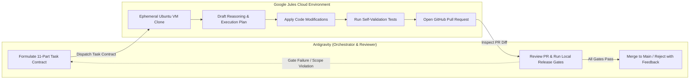
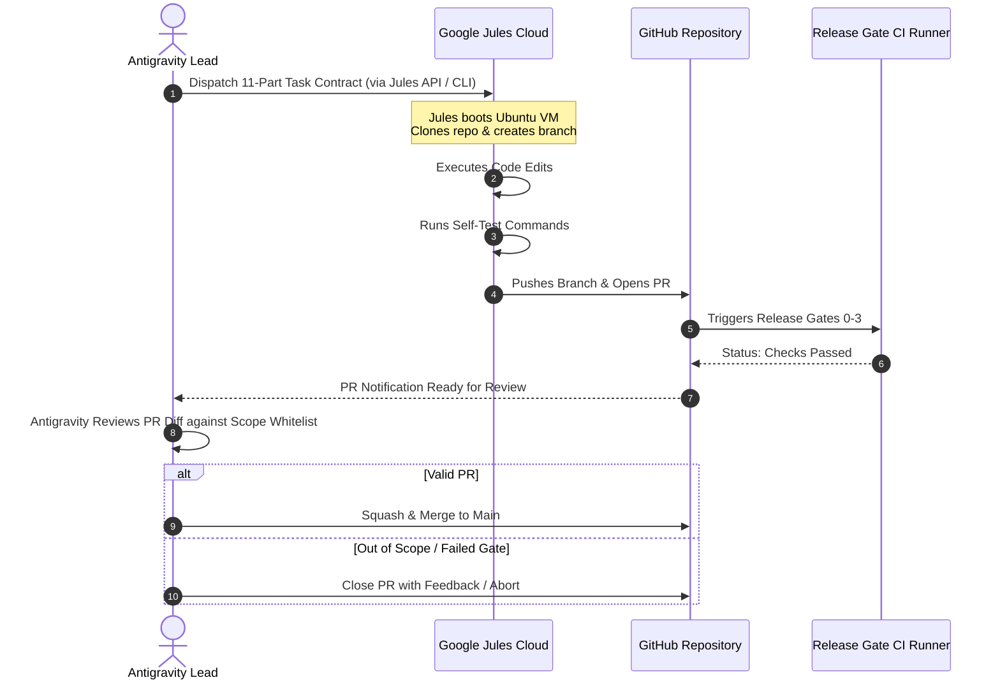

# Google Jules Autonomous Engineering Protocol & Antigravity Coordination
## Document ID: `AGENT-JULES-001`

**Status:** Authoritative Engineering Protocol  
**Version:** 1.0.0  
**Date:** September 2026  
**Lead Authors:** AI-Agent Systems Architect, Lead Autonomous Workflow Engineer  
**Target Repository:** `c:\Users\Suraj\Documents\Antigravity\VibeAudio`  
**Cross-References:** [`AGENT-CAT-001`](./VibeAudio-Jules-Task-Catalog.md), [`QA-GATES-001`](../qa/VibeAudio-Release-Gates.md), [`ROADMAP-001`](../implementation/VibeAudio-Execution-Roadmap.md)

---

## 1. Google Jules Role Definition: Boundary & Epistemic Taxonomy

Google Jules is Google Labs' autonomous, cloud-native software engineering agent. Unlike interactive IDE agents (such as Google Antigravity) that pair-program synchronously in the developer's immediate context window, Jules operates **out-of-band, asynchronously, and within an ephemeral Ubuntu Linux virtual machine**.

To prevent architectural drift, accidental breaking changes, or hallucinated rewrites, Jules' operational boundaries are strictly codified:

### What Jules IS
- A **Bounded Autonomous Engineer** executing discrete, self-contained implementation tasks.
- A **Rigorous Test-First Practitioner** verifying its own modifications using automated terminal commands before submitting code.
- A **Pull Request Generator** delivering clean Git branches and structured pull requests to GitHub.
- A **Refactoring & Polish Specialist** executing token harmonizations, CSS cleanups, unit test expansion, and input validation schemas.

### What Jules IS NOT
- **NOT an Architectural Decision-Maker**: Jules MUST NOT alter project topology, change core paradigms, or invent new patterns.
- **NOT a Database Selector**: Jules is strictly prohibited from selecting or introducing a concrete production database engine (Invariant #2).
- **NOT a Build Tool Integrator**: Jules MUST NOT introduce Webpack, Vite, Rollup, Babel, npm build scripts, or TypeScript compilation steps to the frontend (Invariant #1).
- **NOT an Interactive Chat Agent**: Jules executes against an immutable, structured Task Contract.



---

## 2. The Rigid 11-Part Task Contract Schema

Every task dispatched to Jules MUST be formatted using the following standardized 11-part contract. No task may be submitted with missing, incomplete, or ambiguous sections.

```markdown
### TASK CONTRACT: [TASK-ID] - [TASK TITLE]

#### 1. CONTEXT
[Detailed explanation of the architectural context, existing codebase behavior, and why this task is needed.]

#### 2. OBJECTIVE
[A single, razor-sharp statement of the exact modification required.]

#### 3. FILES IN SCOPE
[Strict whitelist of files Jules is permitted to create or modify. Format: exact relative paths.]
- path/to/file1.js
- path/to/file2.css

#### 4. FILES OUT OF SCOPE
[Strict blacklist of files Jules MUST NOT modify under any circumstances.]
- frontend/src/js/player.js
- package.json
- .stitch/*

#### 5. CONSTRAINTS
- Zero build tools allowed. Native ES Modules only.
- Database selection is intentionally deferred. Use abstract repository mock.
- No external runtime dependencies without prior approval.

#### 6. ACCEPTANCE CRITERIA
- [ ] Criterion 1: Concrete measurable behavior.
- [ ] Criterion 2: Pass condition.
- [ ] Criterion 3: Edge case handling.

#### 7. TEST COMMANDS
[Exact bash commands Jules MUST execute inside its VM before opening a PR.]
node --test tests/example.test.mjs

#### 8. SECURITY REQUIREMENTS
[Mandatory security policies: e.g., input validation, CORS restrictions, zero secrets.]

#### 9. VISUAL REQUIREMENTS (If applicable)
[Token mappings, typography rules, Stitch design specifications.]

#### 10. DO NOT CHANGE
[Explicit list of variables, function signatures, or DOM IDs that MUST remain untouched.]
- Do not modify window.playerInstance
- Do not change CSS class names used by JavaScript hooks

#### 11. EXPECTED OUTPUT
[PR title, branch naming convention, and summary of changes.]
- Branch: jules/task-id-brief-slug
- PR Title: feat(scope): concise description of task
```

---

## 3. Antigravity <-> Jules Interaction Protocol

The operational interaction between Antigravity (the local orchestrator) and Jules (the cloud agent) follows a strict five-step lifecycle:



### Step 1: Formulation & Scope Pre-Flight (Antigravity)
- Antigravity validates that the task has a clear scope, deterministic test commands, and does not violate critical invariants.

### Step 2: Cloud Sandbox Execution (Jules)
- Jules clones the repo, examines files in scope, drafts a plan, applies modifications, and runs the declared test commands.
- If test commands fail, Jules enters an internal self-repair loop (up to 3 iterations).

### Step 3: Pull Request Submission (Jules)
- Jules commits changes with a standardized conventional commit message and opens a GitHub Pull Request detailing its reasoning, changes made, and test outputs.

### Step 4: Antigravity Audit & Verification (Antigravity)
- Antigravity fetches the branch locally:
  ```bash
  git fetch origin pull/[PR_ID]/head:review/jules-[PR_ID]
  git checkout review/jules-[PR_ID]
  ```
- Antigravity executes Gate 0 through Gate 3 verification scripts.
- Antigravity verifies `git diff --stat` against the **FILES IN SCOPE** whitelist.

### Step 5: Integration or Structured Rejection
- If all criteria pass: Squash and merge to `main`.
- If any out-of-scope file was modified, or any test fails: PR is rejected with structured error feedback.

---

## 4. Stop Triggers & Emergency Abort Procedures

### 4.1 Automatic Rejection Triggers
A Jules Pull Request MUST be rejected immediately if any of the following occur:
1. **Scope Violation**: Jules touched any file listed in `FILES OUT OF SCOPE`.
2. **Invariant Violation**: Jules added a bundler config (`vite.config.js`, `webpack.config.js`), a build script to `package.json`, or committed concrete database migration files.
3. **Security Regression**: Jules reintroduced master bypass codes, widened CORS to `*`, or disabled SSRF filters.
4. **Test Regression**: Any existing test in `tests/*.test.mjs` fails.

### 4.2 Emergency Abort Protocol
If Jules enters a hallucinatory or runaway loop:
1. Revoke the active Jules session via the Google Jules API or Google Labs dashboard.
2. Close the associated GitHub Pull Request with label `invalid-agent-run`.
3. Reset local repository state: `git reset --hard HEAD`.
