# VibeAudio Persistence Abstraction Contract

**Document ID:** `ARCH-VIBE-002`  
**Status:** Canonical Persistence Architecture Specification  
**Version:** 1.0.0  
**Date:** September 13, 2026  
**Authors:** Senior Backend Architect, Antigravity Architecture Board  
**Target Repository:** `c:\Users\Suraj\Documents\Antigravity\VibeAudio`  
**Cross-References:** [`MP-VIBE-001`](../plans/VibeAudio-AI-Native-Frontend-Backend-Stitch-Evolution-Master-Plan.md), [`ARCH-VIBE-001`](VibeAudio-Target-Architecture.md), [`DOC-RES-001`](../research/VibeAudio-Frontend-Backend-Stitch-Architecture-Deep-Research.md)

---

## 1. Architectural Intent & Scope

The VibeAudio platform decouples its core business and application logic from physical data storage engines. The current codebase contains fragmented direct calls to AWS DynamoDB (`ScanCommand`, `GetCommand`, `PutCommand`) executed directly within Lambda functions without indexing or caching.

This specification formalizes the **Persistence Abstraction Layer (PAL)**. The PAL establishes a pure, database-agnostic interface boundary defining:
1. Domain entities and data models.
2. Four conceptual domain repositories: `CatalogRepository`, `UserRepository`, `ProgressRepository`, and `LibraryRepository`.
3. Strict consistency models, concurrency controls, and idempotency invariants.
4. Access patterns and query profiles.
5. Technical evaluation criteria for future database selection.

> [!IMPORTANT]
> **Persistence Abstraction Directive:**  
> All application services and cloud compute handlers must interact with data **strictly through these repository interfaces**. Direct instantiation of database drivers (e.g., DynamoDB Client, Cloudflare D1 Client, PostgreSQL Pool) inside route controllers or business services is strictly prohibited.

---

## 2. Domain Data Models & Type Definitions

The persistence contract is defined using strict TypeScript/JSDoc definitions:

```typescript
/**
 * Canonical ISO 8601 UTC Timestamp string (e.g. "2026-09-13T12:00:00.000Z")
 */
export type ISOTimestamp = string;

/**
 * Supported listening languages
 */
export type AudioLanguage = 'en' | 'hi';

/**
 * Chapter Audio Manifest Entity
 */
export interface ChapterEntity {
    readonly chapterIndex: number;
    readonly name: string;
    readonly section: string;
    readonly audioUrl: string;
    readonly durationSec: number;
    readonly sizeBytes: number;
    readonly mimeType: string;
    readonly versionTag: string;
    readonly checksum: string;
    readonly downloadable: boolean;
}

/**
 * Catalog Book Entity
 */
export interface BookEntity {
    readonly bookId: string;
    readonly title: string;
    readonly author: string;
    readonly narrator: string;
    readonly coverImageUrl: string;
    readonly description: string;
    readonly genre: string;
    readonly moods: readonly string[];
    readonly totalDurationSec: number;
    readonly totalChapters: number;
    readonly defaultLanguage: AudioLanguage;
    readonly chapters: readonly ChapterEntity[];
    readonly chapters_en?: readonly ChapterEntity[];
    readonly publishedAt: ISOTimestamp;
    readonly updatedAt: ISOTimestamp;
}

/**
 * User Profile Entity
 */
export interface UserEntity {
    readonly userId: string;             // Clerk User ID or internal canonical ID
    readonly clerkId: string;
    readonly email: string;
    readonly displayName: string;
    readonly avatarUrl?: string;
    readonly tier: 'free' | 'patron' | 'admin';
    readonly createdAt: ISOTimestamp;
    readonly lastLoginAt: ISOTimestamp;
    readonly preferences: {
        readonly preferredLanguage: AudioLanguage;
        readonly defaultPlaybackRate: number;
        readonly autoDownloadWifiOnly: boolean;
        readonly vocalBoosterEnabled: boolean;
    };
}

/**
 * Playback Listening Progress Entity
 */
export interface ProgressEntity {
    readonly userId: string;
    readonly bookId: string;
    readonly language: AudioLanguage;
    readonly chapterIndex: number;
    readonly positionSec: number;
    readonly durationSec: number;
    readonly progressPercent: number;    // Calculated: 0 to 100
    readonly finished: boolean;          // True if progressPercent >= 98%
    readonly lastInteractionAt: ISOTimestamp; // Monotonic client interaction timestamp
    readonly updatedAt: ISOTimestamp;    // Server persistence timestamp
    readonly clientVersion: string;
    readonly deviceId: string;
}

/**
 * User Library Item (Bookmarks, Notes, Saved Titles)
 */
export interface BookmarkEntity {
    readonly bookmarkId: string;
    readonly userId: string;
    readonly bookId: string;
    readonly language: AudioLanguage;
    readonly chapterIndex: number;
    readonly positionSec: number;
    readonly noteText: string;
    readonly createdAt: ISOTimestamp;
    readonly updatedAt: ISOTimestamp;
}

/**
 * Standardized Pagination Parameters
 */
export interface PaginationParams {
    readonly limit: number;
    readonly cursor?: string;
}

/**
 * Standardized Paginated Result Envelope
 */
export interface PaginatedResult<T> {
    readonly items: readonly T[];
    readonly nextCursor?: string;
    readonly totalCount?: number;
}
```

---

## 3. Conceptual Domain Repositories

```mermaid
classDiagram
    class CatalogRepository {
        <<Interface>>
        +getBookById(bookId): Promise~BookEntity~
        +listBooks(params, filter): Promise~PaginatedResult~BookEntity~~
        +searchBooks(query, params): Promise~PaginatedResult~BookEntity~~
        +upsertBook(book): Promise~BookEntity~
    }

    class UserRepository {
        <<Interface>>
        +getUserById(userId): Promise~UserEntity~
        +getUserByClerkId(clerkId): Promise~UserEntity~
        +createUser(user): Promise~UserEntity~
        +updateUserPreferences(userId, prefs): Promise~UserEntity~
        +recordLogin(userId, timestamp): Promise~void~
    }

    class ProgressRepository {
        <<Interface>>
        +getProgress(userId, bookId): Promise~ProgressEntity~
        +listUserProgress(userId, params): Promise~PaginatedResult~ProgressEntity~~
        +upsertProgress(progress, idempotencyKey): Promise~ProgressWriteResult~
        +batchUpsertProgress(userId, entries): Promise~BatchProgressResult~
        +claimGuestProgress(guestUserId, targetUserId): Promise~number~
    }

    class LibraryRepository {
        <<Interface>>
        +getBookmarks(userId, bookId): Promise~BookmarkEntity[]~
        +saveBookmark(bookmark): Promise~BookmarkEntity~
        +deleteBookmark(userId, bookmarkId): Promise~boolean~
        +claimGuestBookmarks(guestUserId, targetUserId): Promise~number~
    }
```



### 3.1 CatalogRepository Specification

The `CatalogRepository` manages the audiobook catalog, chapter manifests, and metadata.

```typescript
export interface CatalogFilter {
    readonly genre?: string;
    readonly language?: AudioLanguage;
    readonly mood?: string;
}

export interface CatalogRepository {
    /**
     * Retrieves an individual book entity by its unique ID.
     * @throws {EntityNotFoundError} if no book matches the ID.
     */
    getBookById(bookId: string): Promise<BookEntity>;

    /**
     * Lists catalog books matching filter criteria with cursor-based pagination.
     */
    listBooks(params: PaginationParams, filter?: CatalogFilter): Promise<PaginatedResult<BookEntity>>;

    /**
     * Performs a text search across book titles, authors, and synopses.
     */
    searchBooks(query: string, params: PaginationParams): Promise<PaginatedResult<BookEntity>>;

    /**
     * Creates or updates a book entity. Privileged administrative operation.
     */
    upsertBook(book: BookEntity): Promise<BookEntity>;
}
```

* **Consistency Guarantee:** Eventual consistency. Catalog data is predominantly static and cached at the Cloudflare Edge.
* **Latency Budget:** Sub-50ms at edge cache; sub-200ms on origin cache miss.

---

### 3.2 UserRepository Specification

The `UserRepository` manages user identities, Clerk account cross-references, and listening preferences.

```typescript
export interface UserRepository {
    /**
     * Retrieves user by canonical platform userId.
     * @throws {EntityNotFoundError} if user does not exist.
     */
    getUserById(userId: string): Promise<UserEntity>;

    /**
     * Retrieves user by external Clerk identity token subject.
     */
    getUserByClerkId(clerkId: string): Promise<UserEntity | null>;

    /**
     * Provisions a new user profile on first authentication.
     * @throws {DuplicateEntityError} if user already exists.
     */
    createUser(user: Omit<UserEntity, 'createdAt' | 'lastLoginAt'>): Promise<UserEntity>;

    /**
     * Updates user preferences (playback rate, language, audio boosts).
     */
    updateUserPreferences(userId: string, preferences: Partial<UserEntity['preferences']>): Promise<UserEntity>;

    /**
     * Updates the user's last login timestamp.
     */
    recordLogin(userId: string, timestamp: ISOTimestamp): Promise<void>;
}
```

* **Consistency Guarantee:** Strong consistency on user creation and profile reads; eventual consistency on `recordLogin`.
* **Latency Budget:** Sub-100ms p95.

---

### 3.3 ProgressRepository Specification

The `ProgressRepository` is the highest-throughput and most sync-critical component in the platform.

```typescript
export interface ProgressWriteResult {
    readonly progress: ProgressEntity;
    readonly committed: boolean;         // True if written, False if rejected by LWW rule
    readonly conflictReason?: 'STALE_TIMESTAMP' | 'TERMINAL_FINISHED';
}

export interface BatchProgressResult {
    readonly processedCount: number;
    readonly committedCount: number;
    readonly rejectedCount: number;
}

export interface ProgressRepository {
    /**
     * Retrieves current listening progress for a user and specific book.
     * Returns null if no listening history exists.
     */
    getProgress(userId: string, bookId: string): Promise<ProgressEntity | null>;

    /**
     * Retrieves all active listening progress records for a user, sorted by recency.
     */
    listUserProgress(userId: string, params: PaginationParams): Promise<PaginatedResult<ProgressEntity>>;

    /**
     * Idempotently upserts listening progress enforcing Monotonic Last-Write-Wins (LWW).
     * 
     * Rules:
     * 1. If incoming.lastInteractionAt <= existing.lastInteractionAt -> Reject (committed = false).
     * 2. If existing.finished === true and incoming.progressPercent < 98% -> Reject (terminal finish protection).
     * 3. If incoming.progressPercent >= 98% -> Force finished = true.
     * 
     * @param progress Incoming progress payload.
     * @param idempotencyKey Client-provided uniqueness token (${userId}:${bookId}:${interactionStamp}).
     */
    upsertProgress(progress: ProgressEntity, idempotencyKey: string): Promise<ProgressWriteResult>;

    /**
     * Ingests a bulk array of progress updates flushed after an offline period.
     * Executes atomic per-book evaluations.
     */
    batchUpsertProgress(userId: string, entries: readonly ProgressEntity[]): Promise<BatchProgressResult>;

    /**
     * Migrates progress records previously logged by a guest session into a user account.
     * Returns the count of migrated records.
     */
    claimGuestProgress(guestUserId: string, targetUserId: string): Promise<number>;
}
```

* **Consistency Guarantee:** Monotonic Last-Write-Wins (LWW). Atomic writes per `(userId, bookId)` key.
* **Latency Budget:** Sub-250ms p95 on single upsert; sub-500ms on batch ingestion.

---

### 3.4 LibraryRepository Specification

The `LibraryRepository` manages listener bookmarks, personal notes, and saved titles.

```typescript
export interface LibraryRepository {
    /**
     * Retrieves all bookmarks saved by a user for a given book.
     */
    getBookmarks(userId: string, bookId: string): Promise<readonly BookmarkEntity[]>;

    /**
     * Saves a new bookmark or updates an existing note.
     */
    saveBookmark(bookmark: Omit<BookmarkEntity, 'bookmarkId' | 'createdAt' | 'updatedAt'>): Promise<BookmarkEntity>;

    /**
     * Deletes a specific bookmark by ID.
     */
    deleteBookmark(userId: string, bookmarkId: string): Promise<boolean>;

    /**
     * Migrates bookmarks saved under a guest session into an authenticated user account.
     */
    claimGuestBookmarks(guestUserId: string, targetUserId: string): Promise<number>;
}
```

* **Consistency Guarantee:** Eventual consistency. Read-your-own-writes per user session.
* **Latency Budget:** Sub-150ms p95.

---

## 4. Error Hierarchy & Contracts

All repository implementations must map underlying database driver errors into standardized domain errors:

```typescript
export class PersistenceError extends Error {
    constructor(message: string, public readonly code: string, public readonly cause?: unknown) {
        super(message);
        this.name = this.constructor.name;
    }
}

export class EntityNotFoundError extends PersistenceError {
    constructor(entityType: string, identifier: string) {
        super(`${entityType} with identifier "${identifier}" was not found.`, 'ENTITY_NOT_FOUND');
    }
}

export class DuplicateEntityError extends PersistenceError {
    constructor(entityType: string, identifier: string) {
        super(`${entityType} with identifier "${identifier}" already exists.`, 'DUPLICATE_ENTITY');
    }
}

export class StaleDataConflictError extends PersistenceError {
    constructor(message: string) {
        super(message, 'STALE_DATA_CONFLICT');
    }
}

export class PersistenceConnectionError extends PersistenceError {
    constructor(message: string, cause?: unknown) {
        super(`Database connection failed: ${message}`, 'PERSISTENCE_CONNECTION_ERROR', cause);
    }
}
```

---

## 5. Workload Profiles & Access Patterns

Understanding the system's runtime behavior is required to guide future database benchmarking:

| Repository / Entity | Read Volume | Write Volume | Burst Characteristic | Primary Key Pattern | Secondary Lookups |
|---|---|---|---|---|---|
| **`CatalogRepository`** | Massive ($10^5$/day) | Extremely Low (Admin only) | Steady traffic, highly cacheable | `bookId` | By Genre, Mood, Search Query |
| **`UserRepository`** | Low ($10^3$/day) | Low ($10^2$/day) | Spikes on marketing campaigns | `userId` | By `clerkId`, By `email` |
| **`ProgressRepository`**| High ($10^4$/day) | High ($10^4$/day) | Extreme bursts on reconnects | `userId#bookId` | By `userId` (recency sort) |
| **`LibraryRepository`** | Medium ($10^3$/day)| Low ($10^2$/day) | User-initiated clicks | `userId#bookmarkId`| By `userId#bookId` |

---

## 6. Future Database Selection Criteria

When database selection is evaluated in a future research phase, candidate engines must be evaluated against this strict rubric:

1. **Global Edge Compatibility:** Can the engine be accessed directly from Cloudflare Workers without connection pooling limits (e.g., HTTP API, Cloudflare D1, Neon serverless driver)?
2. **Serverless Concurrency & Cold Start:** Does the engine handle AWS Lambda burst cold starts without connection exhaustion (supporting managed pooling or connectionless APIs)?
3. **Monotonic Conditional Write Support:** Does the engine support atomic conditional upserts (`WHERE incoming.lastInteractionAt > existing.lastInteractionAt`) in a single round-trip?
4. **Partitioning Model:** Can user data be cleanly partitioned by `userId` to ensure linear scalability?
5. **Cost Model:** Does the engine charge per request, per provisioned capacity, or per storage gigabyte? Is there a generous free/low-tier threshold for indie operation?

---

## 7. Mandatory Architecture Directive

> [!CAUTION]
> **MANDATORY ARCHITECTURAL DIRECTIVE:**  
> **Database selection is intentionally deferred to a dedicated future research phase.**  
> No concrete database engine (AWS DynamoDB, Cloudflare D1, PostgreSQL, Neon, Supabase, PlanetScale, SQLite, etc.) is selected in this specification. All backend services must remain fully abstracted behind the repository interfaces defined herein.
