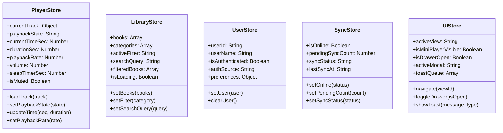
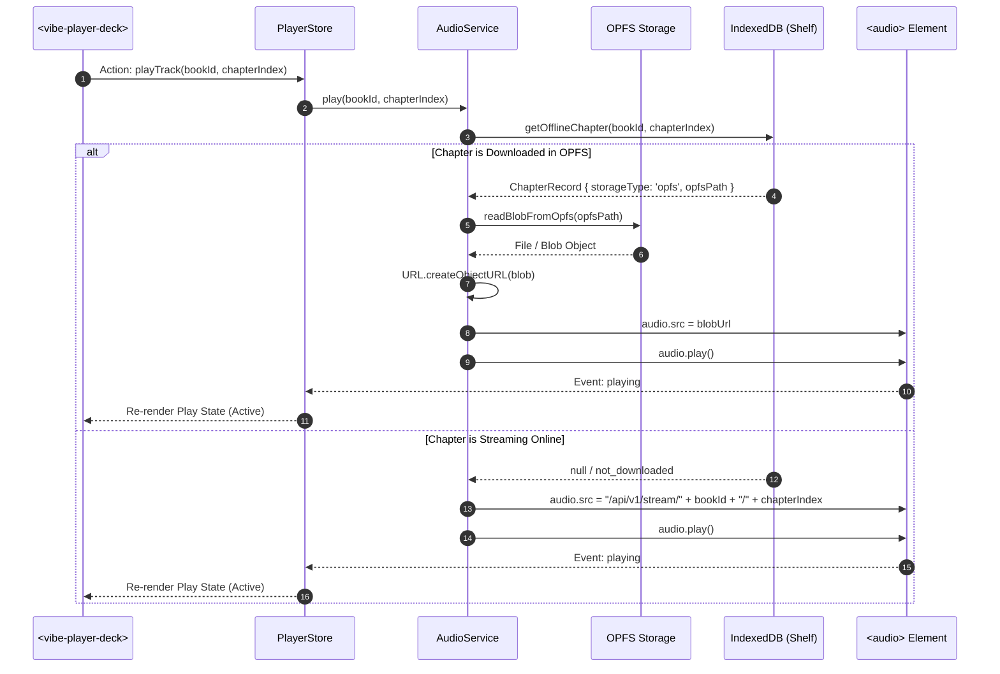
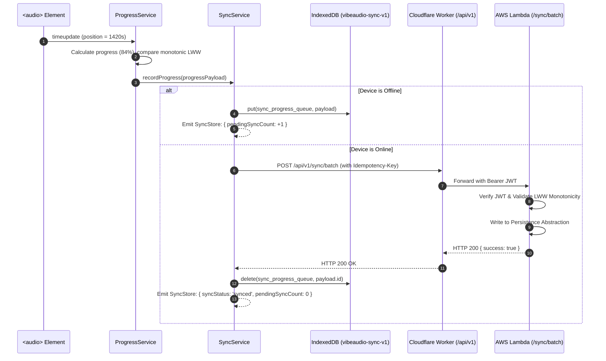

# VibeAudio Target Canonical Architecture Specification

**Document ID:** `ARCH-VIBE-001`  
**Status:** Canonical Target Architecture Specification  
**Version:** 1.0.0  
**Date:** September 13, 2026  
**Authors:** Senior System Architect, Antigravity Architecture Board  
**Target Repository:** `c:\Users\Suraj\Documents\Antigravity\VibeAudio`  
**Cross-References:** [`MP-VIBE-001`](../plans/VibeAudio-AI-Native-Frontend-Backend-Stitch-Evolution-Master-Plan.md), [`ARCH-VIBE-002`](VibeAudio-Persistence-Abstraction.md), [`SPEC-FE-001`](../implementation/VibeAudio-Frontend-Evolution-Spec.md), [`SPEC-OFFLINE-001`](../implementation/VibeAudio-Offline-First-Evolution-Spec.md), [`STITCH-DS-001`](../../.stitch/DESIGN.md)

---

## 1. Architectural Overview & Design Philosophy

VibeAudio is an unabridged, offline-first personal audiobook sanctuary designed to operate natively in modern web browsers without compilation frameworks. The target architecture establishes a clean, decoupled 4-layer structure separating user presentation, observable state, domain business policies, and infrastructure primitives.

```
┌────────────────────────────────────────────────────────────────────────────────────────┐
│                                 LAYER 1: UI LAYER                                      │
│  - Native Custom Elements (<vibe-mini-player>, <vibe-player-deck>, <vibe-scrubber>)   │
│  - CSS Design Tokens (base.css, semantics.css, zero Shadow DOM token inheritance)     │
│  - View Controllers (home-view, library-view, player-view, offline-view, profile-view) │
└───────────────────────────────────────────┬────────────────────────────────────────────┘
                                            │ Dispatches Actions / Observes
                                            ▼
┌────────────────────────────────────────────────────────────────────────────────────────┐
│                        LAYER 2: APPLICATION STATE LAYER                                │
│  - PlayerStore (Playback state, track metadata, elapsed time, rate, sleep timer)       │
│  - LibraryStore (Catalog snapshot, active filters, search index, sorted books)         │
│  - UserStore (Session identity, guest vs Clerk user, subscription tier)                │
│  - SyncStore (Online/offline state, pending queue tally, sync engine status)           │
│  - UIStore (Active view section, modal dialogs, drawer expansions, toast notifications)│
└───────────────────────────────────────────┬────────────────────────────────────────────┘
                                            │ Invokes Operations
                                            ▼
┌────────────────────────────────────────────────────────────────────────────────────────┐
│                            LAYER 3: DOMAIN SERVICES LAYER                              │
│  - AudioService (HTML5 <audio>, DSP vocal booster node graph, MediaSession bridge)     │
│  - DownloadService (OPFS byte-range chunks, .part-to-.bin assembly, retry state machine│
│  - ProgressService (LWW monotonic freshness evaluation, terminal finish protection)    │
│  - SyncService (Queue serialization, batch reconciliation, guest migration hook)       │
│  - LibraryService (Catalog normalization, client search filtering, chapter lookups)    │
└───────────────────────────────────────────┬────────────────────────────────────────────┘
                                            │ Calls Platform Adapters
                                            ▼
┌────────────────────────────────────────────────────────────────────────────────────────┐
│                          LAYER 4: INFRASTRUCTURE LAYER                                 │
│  ┌──────────────────────────────────────────────┐ ┌──────────────────────────────────┐ │
│  │         LOCAL-FIRST STORAGE SUBSYSTEM        │ │       NETWORK & CLOUD SUBSYSTEM  │ │
│  │ - Origin Private File System (OPFS audio)    │ │ - Service Worker (v14-production)│ │
│  │ - IndexedDB: vibeaudio-offline-v1 (metadata) │ │ - Cloudflare Workers (Edge API)  │ │
│  │ - IndexedDB: vibeaudio-sync-v1 (sync queue)  │ │ - AWS Lambda (Secure Compute Core│ │
│  │ - CacheStorage (4 specialized caches)        │ │ - Cloudflare R2 (Audio storage)  │ │
│  │ - LocalStorage (Synchronous resume state)    │ │ - Persistence Abstraction (DEF)  │ │
│  └──────────────────────────────────────────────┘ └──────────────────────────────────┘ │
└────────────────────────────────────────────────────────────────────────────────────────┘
```

---

## 2. Layer 1: UI Presentation Layer

The UI layer is responsible exclusively for rendering visual elements and capturing user inputs. It contains zero audio decoding logic, zero direct database access, and zero network calls.

### 2.1 Native Custom Elements (Zero Shadow DOM)

VibeAudio encapsulates complex interactive controls as standard HTML5 Web Components (`CustomElementRegistry`). 

> [!IMPORTANT]
> **Zero Shadow DOM Invariant:**  
> All VibeAudio Custom Elements are instantiated **without Shadow DOM** (`this.attachShadow` is strictly forbidden). Elements render directly into the light DOM tree. This ensures:
> 1. Complete and seamless inheritance of CSS custom properties declared in `:root` (`--color-canvas`, `--color-accent`, etc.).
> 2. Full application of global typography styles (`Newsreader`, `Inter`, `JetBrains Mono`).
> 3. Zero styling duplication or polyfill overhead.
> 4. Full accessibility tree visibility for screen readers without shadow boundary traversal.

#### Core Custom Elements:
* `<vibe-mini-player>`: The persistent 62px frosted glass dock. Encapsulates micro progress bar, 42×42px cover art, single-line clamped title, and 3-button transport (-15s, 42px Play circle, +30s).
* `<vibe-player-deck>`: The full player tactile transport controls. Houses playback speed toggle (0.75x–2.0x), jump buttons, main 56px play button with ambient halo, and sleep timer trigger.
* `<vibe-scrubber>`: High-precision seeking component. Manages mouse/touch drag scrubbing, buffered audio ranges, and tabular `JetBrains Mono` elapsed/remaining timecodes.
* `<vibe-book-card>`: Canonical 2:3 vertical paperback card. Features squircle elevation on hover, top-left genre kicker, and bottom-left offline download status indicator.

### 2.2 CSS Design Token Inheritance

The presentation layer consumes tokens structured across a 3-tier hierarchy:
1. **Primitive Tokens (`primitives.css`):** Raw palette hex values, fundamental type curves, and baseline spacing steps.
2. **Semantic Tokens (`semantics.css`):** Intent-based mappings (`--color-canvas: #F5F5F7`, `--color-surface-1: #FFFFFF`, `--color-accent: #C64E00`, `--color-text-primary: #1D1D1F`).
3. **Component Tokens (`dimensions.css`):** Bounded element rules (`--book-card-radius: 14px`, `--dock-height: 62px`, `--shadow-dock: 0 16px 44px rgba(0,0,0,0.10)`).

---

## 3. Layer 2: Application State Layer

Application state is held in isolated, reactive, in-memory observable stores. Components and services interact with state via explicit actions and subscription callbacks, preventing cross-module DOM pollution.

### 3.1 Store Architecture (`core/store.js`)

All stores are built on a shared, ultra-lightweight observable pattern:

```javascript
export function createStore(initialState) {
    let state = Object.freeze({ ...initialState });
    const listeners = new Set();

    return {
        getState: () => state,
        setState: (partial) => {
            const next = Object.freeze({ ...state, ...partial });
            if (next !== state) {
                state = next;
                listeners.forEach((listener) => listener(state));
            }
        },
        subscribe: (listener) => {
            listeners.add(listener);
            listener(state);
            return () => listeners.delete(listener);
        }
    };
}
```

### 3.2 Canonical Store Inventory



---

## 4. Layer 3: Domain Services Layer

Domain services encapsulate business logic and policies. They are completely decoupled from DOM manipulation and communicate with the UI exclusively through Application Stores.

### 4.1 AudioService
* **Responsibilities:** Manages the dual-engine audio playback system: HTML5 `<audio id="audio-element">` for native streams / OPFS blobs, and hidden YouTube iframe for streaming video books.
* **Vocal Booster DSP Graph:** Connects a 4-stage Web Audio API node graph (`createMediaElementSource`):
  1. Bass cut highpass filter (0 Hz to 150 Hz).
  2. Vocal peaking EQ (2500 Hz, Q 1.0, +8 dB boost).
  3. Treble articulation highshelf (5000 Hz, +6 dB).
  4. Dynamics compressor (-24 dB threshold, 12:1 compression ratio).
* **MediaSession Bridge:** Defensively updates `navigator.mediaSession` metadata, artwork arrays, and playback state. Implements bounds sanitization to prevent WebKit lockscreen crashes.

### 4.2 DownloadService
* **Responsibilities:** Governs chapter downloads from remote storage to local device sandboxes.
* **Lifecycle:** Evaluates download eligibility -> Allocates `.part` file in OPFS -> Issues HTTP `Range` request -> Streams chunks to disk via `FileSystemWritableFileStream` -> Validates file checksum -> Atomically renames to `.bin` -> Updates IndexedDB `offline_chapters` -> Emits telemetry event.
* **Retry Engine:** Implements exponential backoff with jitter (`[10s, 25s, 60s]`) for transient network dropouts.

### 4.3 ProgressService
* **Responsibilities:** Calculates listening progress percentages, enforces the 98% completed threshold, and resolves multi-device synchronization conflicts.
* **Monotonic Freshness Engine:** Compares local and incoming cloud records using the Last-Write-Wins (LWW) timestamp rule. Enforces terminal finish protection: a book marked `finished = true` cannot be reverted to unread by an older in-flight timestamp.

### 4.4 SyncService
* **Responsibilities:** Manages the offline sync queue (`vibeaudio-sync-v1`).
* **Lifecycle:** Detects online events or service worker `sync` triggers -> Reads uncommitted progress records -> Dispatches batch sync request to `/api/v1/sync/batch` with idempotency tokens -> Purges synced items from local store -> Updates `SyncStore`.
* **Guest Migration Orchestrator:** Triggers `migrateGuestDataToUser(newUserId)` when a guest converts to an authenticated Clerk session.

### 4.5 LibraryService
* **Responsibilities:** Normalizes catalog payloads, executes debounced client-side full-text searches, filters by genre and mood tags, and caches catalog representations for offline discovery.

---

## 5. Layer 4: Infrastructure Layer

The infrastructure layer isolates platform-specific APIs, storage devices, and cloud networks from domain logic.

### 5.1 Local-First Storage Subsystem

```
┌────────────────────────────────────────────────────────────────────────┐
│                    LOCAL-FIRST STORAGE SUBSYSTEM                       │
├───────────────────┬───────────────────┬────────────────────────────────┤
│ Storage Engine    │ Database / Path   │ Technical Role & Content       │
├───────────────────┼───────────────────┼────────────────────────────────┤
│ OPFS              │ `/offline-audio/` │ Unabridged audio binaries (.bin│
│                   │                   │ and temporary in-flight .part) │
├───────────────────┼───────────────────┼────────────────────────────────┤
│ IndexedDB (Shelf) │ `vibeaudio-       │ 5 Object Stores: books,        │
│                   │  offline-v1`      │ chapters, jobs, settings, stats│
├───────────────────┼───────────────────┼────────────────────────────────┤
│ IndexedDB (Sync)  │ `vibeaudio-       │ Object Store:                  │
│                   │  sync-v1`         │ sync_progress_queue            │
├───────────────────┼───────────────────┼────────────────────────────────┤
│ CacheStorage      │ 4 Versioned       │ Static precache, runtime scripts│
│                   │ Caches            │ JSON catalog data, cover images│
├───────────────────┼───────────────────┼────────────────────────────────┤
│ LocalStorage      │ Synchronous Keys  │ Instant cold-start resume time,│
│                   │                   │ playback rate, theme clamps    │
└───────────────────┴───────────────────┴────────────────────────────────┘
```

#### CacheStorage Architecture (4 Dedicated Caches):
The Service Worker (`frontend/service-worker.js`, cache version `v14-production`) segments assets across four distinct caches to prevent runtime data from evicting static application shells:
1. `vibeaudio-static-v14-production`: Core application shell, HTML files, 7 modular CSS files, 18 native ESM modules, localized WOFF2 web fonts, and the 66-symbol SVG sprite. Precached on service worker `install`.
2. `vibeaudio-runtime-v14-production`: External CDN dependencies (GSAP, VanillaTilt, ColorThief) and runtime utilities. Stale-While-Revalidate caching strategy.
3. `vibeaudio-data-v14-production`: Catalog metadata and JSON manifests (`/api/v1/catalog`). Network-first with Cache fallback.
4. `vibeaudio-images-v14-production`: Audiobook cover artwork (WebP/AVIF). Stale-While-Revalidate with maximum cache size capping.

### 5.2 Network & Cloud Subsystem

```
┌──────────────┐
│ Browser App  │
└──────┬───────┘
       │ HTTPS / Range Requests
       ▼
┌────────────────────────────────────────────────────────┐
│                CLOUDFLARE EDGE NETWORK                 │
│  - Cloudflare Pages: Zero-build PWA static hosting     │
│  - Cloudflare Worker (/api/v1/): Global edge routing   │
│  - Cloudflare Edge Cache: Sub-50ms catalog delivery    │
│  - Streaming Media Proxy: Zero-egress R2 audio routing │
└──────┬───────────────────────────────────┬─────────────┘
       │ Low-Latency Edge Workloads        │ Core Compute Workloads
       │ (Cached Catalog / Media Stream)   │ (Auth, Sync, Migrations)
       ▼                                   ▼
┌──────────────────┐             ┌──────────────────────────────────┐
│  Cloudflare R2   │             │     AWS LAMBDA COMPUTE CORE      │
│  Object Storage  │             │  - Clerk JWT JWKS Verification   │
│  (Audio Files)   │             │  - Idempotent Progress Upserts   │
└──────────────────┘             │  - Bulk Offline Sync Processor   │
                                 │  - Guest Migration Hook          │
                                 └──────────────┬───────────────────┘
                                                │ Repository Interface
                                                ▼
                                 ┌──────────────────────────────────┐
                                 │      PERSISTENCE ABSTRACTION     │
                                 │     (DATABASE ENGINE DEFERRED)   │
                                 └──────────────────────────────────┘
```

---

## 6. Workload Split Matrix: Cloudflare Workers vs AWS Lambda

To optimize performance, global latency, egress costs, and security, responsibilities are cleanly bifurcated between the Cloudflare Edge and the AWS Lambda Compute Core:

| Dimension / Capability | Cloudflare Workers (Edge Layer) | AWS Lambda (Core Compute Layer) |
|---|---|---|
| **Primary Workloads** | Global API routing, static catalog caching, media streaming proxying with HTTP Range support, DDoS mitigation, PWA shell delivery. | Clerk JWT verification, user identity provisioning, monotonic progress sync, bulk offline queue reconciliation, guest-to-user migrations. |
| **Execution Context** | V8 isolates distributed across 300+ edge points of presence. | Managed Node.js containerized micro-runtimes in primary AWS region (`ap-south-1`). |
| **Latency Targets** | **Sub-50ms p95** for cached catalog and edge-routed endpoints. | **Sub-250ms p95** for transactional database writes and JWT validations. |
| **Cold Start Behavior** | **0ms (Instant)**. V8 isolates incur negligible spin-up delay. | **<200ms**. Minimized through ESBuild modular packaging (<5 MB bundle). |
| **Data Egress Cost** | **Zero egress fees** when proxying media from Cloudflare R2. | Standard AWS outbound data transfer costs apply. |
| **Caching Model** | Edge Cache API (`Cache-Control: public, s-maxage=3600, stale-while-revalidate=86400`). | No edge response caching. All requests hit application logic. |
| **Authentication Enforcement** | Edge rate-limiting and origin validation. Passes JWTs to compute. | Cryptographic verification of Clerk JWT tokens against Clerk JWKS. |
| **Statefulness & Concurrency** | Ephemeral, stateless request handling. | Managed concurrency limits with database connection pooling. |

---

## 7. Data Flow Sequences

### 7.1 Offline Audio Playback Flow



### 7.2 Offline Listening & Reconnection Sync Flow



---

## 8. Architectural Integrity & Evolution Boundaries

1. **Framework Ban:** The target architecture maintains zero build steps. No React, Vue, Next.js, or Svelte will be introduced.
2. **Database Engine Agnosticism:** The system architecture intentionally stops at the Persistence Abstraction contract ([`ARCH-VIBE-002`](VibeAudio-Persistence-Abstraction.md)). No specific cloud database engine is coupled to this architecture.
3. **Stitch Alignment:** All presentation geometry, responsive breakpoints (375px, 768px, 1280px), color roles, and animation curves are governed by [`.stitch/DESIGN.md`](../../.stitch/DESIGN.md).
