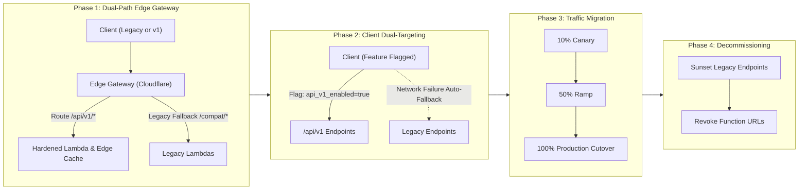
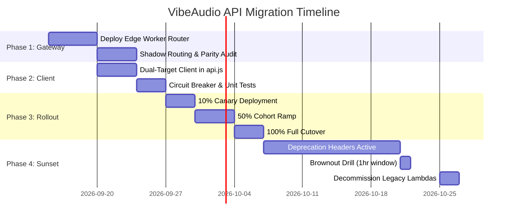

# VibeAudio API Migration & Backward Compatibility Strategy
## Document ID: `PLAN-MIG-001`

**Status:** Authoritative Engineering Baseline  
**Version:** 1.0.0  
**Date:** September 2026  
**Lead Authors:** Systems Architect, Principal Infrastructure Engineer, Frontend Lead  
**Target Repository:** `c:\Users\Suraj\Documents\Antigravity\VibeAudio`  
**Cross-References:** [`SPEC-API-001`](./VibeAudio-Backend-Hybrid-API-Spec.md), [`SEC-BASE-001`](../security/VibeAudio-Backend-Security-Baseline.md), [`QA-GATES-001`](../qa/VibeAudio-Release-Gates.md)

---

## 1. Executive Summary & Migration Objectives

The existing VibeAudio client invokes raw AWS Lambda Function URLs and an unsecured Cloudflare Worker directly from [`frontend/src/js/api.js`](file:///c:/Users/Suraj/Documents/Antigravity/VibeAudio/frontend/src/js/api.js). This exposes internal cloud compute endpoints to the public Internet, lacks unified API contracts, and prevents smooth deployments.

This migration plan defines an airtight, **zero-downtime, four-phase migration** from legacy direct Lambda endpoints to the unified **Cloudflare Edge Gateway (`/api/v1/*`)**.



---

## 2. The Four-Phase Migration Architecture

### Phase 1: Compatibility Edge Gateway & Shadow Routing
- **Objective**: Deploy the Cloudflare Worker Edge Gateway without changing existing frontend production behavior.
- **Actions**:
  1. Stand up Cloudflare Worker route handling `https://api.vibeaudio.com/api/v1/*`.
  2. Implement a reverse-proxy compatibility bridge for legacy paths (`/getBooks`, `/getBookDetails`, `/getProgress`, `/saveProgress`).
  3. Deploy shadow request duplication in Edge Worker: 5% of catalog traffic is mirrored to `/api/v1/catalog` to compare response payloads and latency profiles.
- **Telemetry**: Verify zero divergence between legacy Lambda outputs and `/api/v1` payloads.

### Phase 2: Dual-Target Client Adaptation in `frontend/src/js/api.js`
- **Objective**: Equip the frontend with a dual-target HTTP client capable of routing to either legacy Lambda URLs or `/api/v1` based on runtime configuration and dynamic health checks.
- **Client Implementation Details**:
  - Feature flag `VIBE_API_V1_ENABLED` stored in `localStorage` or injected via `app.webmanifest` meta tags.
  - Automatic degradation: If `/api/v1` returns consecutive 5xx errors or network timeouts (> 5000ms), the client temporarily degrades to legacy endpoints for 10 minutes.

```javascript
// Dual-Target Client Pattern for frontend/src/js/api.js
const API_ENDPOINTS = {
  v1: {
    catalog: "https://api.vibeaudio.com/api/v1/catalog",
    bookDetails: (id) => `https://api.vibeaudio.com/api/v1/catalog/${encodeURIComponent(id)}`,
    progress: "https://api.vibeaudio.com/api/v1/user/progress",
    syncBatch: "https://api.vibeaudio.com/api/v1/sync/batch",
    authSession: "https://api.vibeaudio.com/api/v1/auth/session"
  },
  legacy: {
    catalog: APP_CONFIG.catalogUrl,
    progress: APP_CONFIG.progressUrl,
    getProgress: APP_CONFIG.getProgressUrl,
    syncUser: APP_CONFIG.syncUserUrl
  }
};

let v1FailureCount = 0;
const V1_MAX_FAILURES = 3;
const CIRCUIT_BREAKER_RESET_MS = 10 * 60 * 1000;
let circuitBreakerTrippedUntil = 0;

function isV1ApiEnabled() {
  if (Date.now() < circuitBreakerTrippedUntil) return false;
  return localStorage.getItem("vibe_flag_api_v1") !== "false";
}

function recordV1Outcome(success) {
  if (success) {
    v1FailureCount = 0;
  } else {
    v1FailureCount += 1;
    if (v1FailureCount >= V1_MAX_FAILURES) {
      circuitBreakerTrippedUntil = Date.now() + CIRCUIT_BREAKER_RESET_MS;
      console.warn("API v1 circuit breaker tripped. Falling back to legacy API.");
    }
  }
}
```

### Phase 3: Traffic Migration & Canary Ramp
- **Ramp Schedule**:
  - **Canary (10%)**: Enabled for internal team and beta testers via `localStorage.setItem('vibe_flag_api_v1', 'true')`. Monitored for 48 hours.
  - **Cohort A (50%)**: Edge Gateway randomly allocates 50% of incoming anonymous catalog queries to `/api/v1/catalog`.
  - **Full Cutover (100%)**: Default client behavior switches to `/api/v1`.
- **Exit Criteria for Phase 3**:
  - P95 Edge Latency < 100ms.
  - P95 Compute Latency (AWS Lambda) < 250ms.
  - 5xx error rate < 0.05% across a continuous 72-hour window.

### Phase 4: Deprecation, Sunsetting & Decommissioning
- **Step 1: Deprecation Warning (Days 0–30)**:
  - Any request arriving at legacy Lambda Function URLs receives an `X-Vibe-Deprecation: true` response header and a Sunset HTTP header: `Sunset: Wed, 15 Oct 2026 00:00:00 GMT`.
- **Step 2: Brownout Testing (Day 31)**:
  - Legacy endpoints return simulated 503 Service Unavailable for 1 hour at scheduled windows (e.g., 03:00 UTC) to verify client fallback resilience.
- **Step 3: Full Revocation (Day 45)**:
  - AWS Lambda Function URLs are permanently deleted.
  - Lambdas are moved strictly behind private AWS API Gateway / VPC endpoints accessible only by Cloudflare Worker edge credentials.

---

## 3. Service Level Objectives (SLOs) & Error Budgets

| Metric | Target SLO | Warning Threshold | Critical Incident Trigger |
| :--- | :--- | :--- | :--- |
| **Edge Gateway Availability** | 99.95% | < 99.90% | < 99.50% |
| **Compute (/api/v1/user/progress) Availability** | 99.90% | < 99.80% | < 99.00% |
| **P95 Edge Latency (/catalog)** | < 80ms | > 120ms | > 300ms |
| **P95 Compute Latency (/progress upsert)** | < 250ms | > 400ms | > 800ms |
| **5xx Error Rate** | < 0.05% | > 0.10% | > 0.50% |

### Error Budget Policy
If the 30-day error budget is consumed by more than 50% during any migration phase, **all promotion is immediately frozen**. The migration team must resolve latency or exception regressions before increasing traffic allocation.

---

## 4. Rollback Mechanisms & Emergency Runbook

### 4.1 Instant Kill-Switch Options
1. **Edge Gateway Remote Toggle**: Cloudflare Worker checks KV flag `API_V1_GLOBAL_ACTIVE`. Toggling to `false` causes the edge router to instantly forward all traffic to legacy Lambda targets within 5 seconds worldwide.
2. **Client-Side Override**: Users experiencing issues can visit `https://vibeaudio.com/#force-legacy-api`, which writes `vibe_flag_api_v1: "false"` into `localStorage`.

### 4.2 Emergency Rollback Step-by-Step Runbook
```bash
# 1. Flip KV Global Active flag to disable v1 routing at edge
wrangler kv:key put --binding=CONFIG_KV "API_V1_GLOBAL_ACTIVE" "false"

# 2. Invalidate Cloudflare Edge Cache for catalog and manifests
wrangler cache purge --zone=vibeaudio.com

# 3. Verify client traffic reverts to legacy endpoints via real-time logs
wrangler tail --format=pretty
```

---

## 5. Migration Timeline & Milestone Matrix


