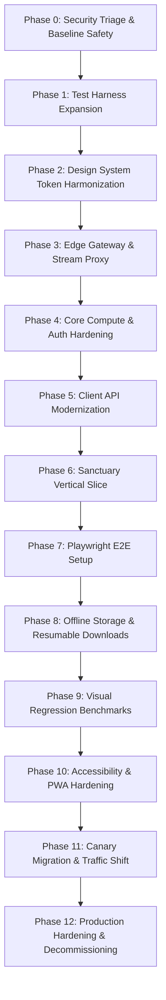

# VibeAudio 13-Phase Executable Engineering Roadmap
## Document ID: `ROADMAP-001`

**Status:** Authoritative Engineering Baseline  
**Version:** 1.0.0  
**Date:** September 2026  
**Lead Authors:** Technical Program Manager, Principal Systems Architect, QA Lead  
**Target Repository:** `c:\Users\Suraj\Documents\Antigravity\VibeAudio`  
**Cross-References:** [`ROADMAP-001`](#), [`GRAPH-001`](./VibeAudio-Implementation-Dependency-Graph.md), [`QA-GATES-001`](../qa/VibeAudio-Release-Gates.md), [`AGENT-CAT-001`](../agents/VibeAudio-Jules-Task-Catalog.md)

---

## 1. Roadmap Architecture & Execution Philosophy

This roadmap translates the Stitch "Light Editorial Sanctuary" vision, the Hybrid Backend Topology, and the hardened security baseline into **13 concrete, phased engineering milestones**.

Every phase defines explicit task scope, file boundaries, risk analysis, testing gates, rollback plans, and clear agent ownership (**Antigravity** for interactive/architectural work vs. **Jules** for autonomous tasks).

---

## 2. Detailed Phase Specifications (Phases 0 through 12)

---

### Phase 0: Security Triage & Baseline Safety
- **Objective**: Immediately remediate critical vulnerabilities (SSRF, master codes, wildcard CORS, missing dependencies).
- **Prerequisites**: Access to repository main branch.
- **Tasks**:
  1. Patch SSRF in `proxymanager.js` with domain allowlist and header filtering.
  2. Permanently delete `validCodes` master access bypass from `backend/lambda/auth.js`.
  3. Replace wildcard CORS with strict origin checking regex (`*.vibeaudio.pages.dev`).
  4. Add `@aws-sdk/client-s3` and `@aws-sdk/s3-request-presigner` to `backend/package.json`.
- **Files Affected**:
  - `backend/workers/proxymanager.js`
  - `backend/lambda/auth.js`
  - `backend/lambda/saveProgress.js`, `getProgress.js`, `getBookDetails.js`
  - `backend/package.json`
- **Agent Ownership**: Antigravity (Supervised execution).
- **Risks**: Blocking legitimate media CDNs if allowlist is too strict.
- **Tests**: `node tests/security-baseline.test.mjs`.
- **Exit Gate**: `GATE-01-SEC-HARDEN` (PASS).
- **Rollback Plan**: Revert commit via git; ensure allowlist includes required fallback origins.

---

### Phase 1: Test Harness & Native Suite Expansion
- **Objective**: Expand deterministic test coverage for core domain logic prior to refactoring.
- **Prerequisites**: Phase 0 complete.
- **Tasks**:
  1. Author unit tests for `progress-model.js` edge cases and timestamp monotonicity.
  2. Author unit tests for `user-data.js` storage key generation and pending queue state.
  3. Implement mock DynamoDB Document Client test harness for Lambda handlers.
- **Files Affected**:
  - `tests/progress-model.test.mjs`
  - `tests/user-data.test.mjs`
  - `tests/lambda-handlers.test.mjs`
- **Agent Ownership**: Jules (Autonomous via `EXP-02` & `EXP-03`).
- **Risks**: None (Test additions only; zero production code modified).
- **Tests**: `node --test tests/*.test.mjs`.
- **Exit Gate**: `GATE-00-REPO-BASE` (100% tests passing).
- **Rollback Plan**: Delete unmerged test branch.

---

### Phase 2: Design System Token Harmonization (Stitch Alignment)
- **Objective**: Harmonize CSS variables and typography tokens with `.stitch/DESIGN.md`.
- **Prerequisites**: Phase 1 complete.
- **Tasks**:
  1. Update `--color-accent` to `#C64E00` and `--color-canvas` to `#F5F5F7` in `base.css`.
  2. Clean up dead utility classes and legacy dark overrides.
  3. Validate SVG icon stroke uniformity (1.85px) in `icons.svg`.
- **Files Affected**:
  - `frontend/src/css/base.css`
  - `frontend/src/css/components.css`
  - `frontend/src/icons/icons.svg`
- **Agent Ownership**: Jules (Autonomous via `EXP-01`).
- **Risks**: Unintended CSS layout shifts if class names are changed.
- **Tests**: `node --test tests/ui-contracts.test.mjs tests/icon-system.test.mjs`.
- **Exit Gate**: `GATE-02-ARCH-INTEG` & `GATE-06-STITCH-VISUAL` (Preliminary).
- **Rollback Plan**: Git revert styling branch.

---

### Phase 3: Edge Gateway & Stream Proxying
- **Objective**: Deploy Cloudflare Worker Edge Gateway handling `/api/v1/*` routes.
- **Prerequisites**: Phase 0 complete.
- **Tasks**:
  1. Build Worker router handling `GET /api/v1/catalog` with 1-hour edge cache.
  2. Implement `GET /api/v1/stream/:bookId/:chapterId` with signed token verification and HTTP 206 Range proxying to Cloudflare R2.
  3. Enforce Cloudflare Edge rate limiting rules.
- **Files Affected**:
  - `backend/workers/edge-router.js`
  - `backend/workers/proxymanager.js`
  - `wrangler.toml`
- **Agent Ownership**: Antigravity (Architectural edge deployment).
- **Risks**: Cloudflare Worker execution limits on high-concurrency audio chunk proxying.
- **Tests**: `node --test tests/edge-router.test.mjs`.
- **Exit Gate**: `GATE-04-BACKEND-API` (Edge routes passing).
- **Rollback Plan**: Revert Wrangler route bindings to legacy endpoints.

---

### Phase 4: Core Compute & Auth Hardening
- **Objective**: Refactor AWS Lambda handlers to use Clerk JWKS token validation and LWW progress resolution.
- **Prerequisites**: Phase 0 & Phase 1 complete.
- **Tasks**:
  1. Implement shared Clerk JWKS verification middleware (`backend/shared/auth-middleware.js`).
  2. Refactor `saveProgress.js` and `getProgress.js` to derive identity strictly from JWT `claims.sub`.
  3. Implement `POST /api/v1/user/migrate-guest` for atomic guest-to-user progress transfer.
  4. Implement `POST /api/v1/sync/batch` bulk progress flush.
- **Files Affected**:
  - `backend/lambda/auth.js`
  - `backend/lambda/saveProgress.js`
  - `backend/lambda/getProgress.js`
  - `backend/lambda/migrateGuest.js`
  - `backend/lambda/syncBatch.js`
- **Agent Ownership**: Antigravity + Jules (Tasks A03, A06).
- **Risks**: Clerk JWKS latency overhead during cold starts (mitigated by in-memory key caching).
- **Tests**: `node --test tests/lambda-handlers.test.mjs tests/security-baseline.test.mjs`.
- **Exit Gate**: `GATE-01-SEC-HARDEN` & `GATE-04-BACKEND-API`.
- **Rollback Plan**: Restore Lambda code from previous Git tag.

---

### Phase 5: Client API Modernization
- **Objective**: Equip `frontend/src/js/api.js` with a dual-target architecture and circuit breaker.
- **Prerequisites**: Phase 3 & Phase 4 complete.
- **Tasks**:
  1. Add `/api/v1` route definitions to `api.js`.
  2. Add feature flag evaluation (`vibe_flag_api_v1`) and circuit breaker for automatic fallback.
  3. Update `auth.js` to trigger session sync and guest migration on login.
- **Files Affected**:
  - `frontend/src/js/api.js`
  - `frontend/src/js/auth.js`
  - `frontend/src/js/config.js`
- **Agent Ownership**: Jules (Task D01, Review Required).
- **Risks**: False-positive circuit breaker trips on slow network connections.
- **Tests**: `node --test tests/api-client.test.mjs tests/guest-migration.test.mjs`.
- **Exit Gate**: `GATE-02-ARCH-INTEG` (Zero build step preserved).
- **Rollback Plan**: Toggle `vibe_flag_api_v1: "false"` in client config.

---

### Phase 6: Sanctuary Vertical Slice End-to-End Integration
- **Objective**: Execute the complete end-to-end integration slice connecting UI, Edge Worker, and Lambda.
- **Prerequisites**: Phases 0 through 5 complete.
- **Tasks**:
  1. Connect catalog shelf in `ui.js` to `/api/v1/catalog`.
  2. Connect audio player to `/api/v1/stream/...` with signed stream tokens.
  3. Validate end-to-end user journey (Catalog ➔ Stream ➔ Save Progress ➔ Sign In ➔ Migrate).
- **Files Affected**:
  - `frontend/src/js/ui.js`
  - `frontend/src/js/player.js`
  - `tests/sanctuary-vertical-slice.test.mjs`
- **Agent Ownership**: Antigravity (Integration Lead).
- **Risks**: Cross-origin timing discrepancies between Edge and Lambda.
- **Tests**: `node --test tests/sanctuary-vertical-slice.test.mjs`.
- **Exit Gate**: `SPEC-SLICE-001` Acceptance Sign-Off.
- **Rollback Plan**: Revert frontend API target to legacy Lambda URLs.

---

### Phase 7: Playwright Cross-Browser QA Harness Setup
- **Objective**: Scaffold zero-build static Playwright runner across 5 target browser platforms.
- **Prerequisites**: Phase 6 complete.
- **Tasks**:
  1. Author `playwright.config.ts` configuring Chromium, WebKit, Firefox, Pixel 5, and iPhone 13.
  2. Author test specs: `player.spec.ts`, `offline.spec.ts`, `sync.spec.ts`.
  3. Implement network route mocking fixtures.
- **Files Affected**:
  - `playwright.config.ts`
  - `tests/e2e/*.spec.ts`
  - `tests/e2e/fixtures/*`
- **Agent Ownership**: Antigravity + Jules (Task C05).
- **Risks**: Flakiness in headless WebKit audio autoplay.
- **Tests**: `npx playwright test`.
- **Exit Gate**: `GATE-05-PLAYWRIGHT-PARITY` (100% pass).
- **Rollback Plan**: Adjust retry threshold to 2 in CI.

---

### Phase 8: Offline Storage Engine & Resumable Downloads
- **Objective**: Harden OPFS audio caching and implement resumable chunk downloads.
- **Prerequisites**: Phase 7 complete.
- **Tasks**:
  1. Enhance `offline-shelf.js` with byte-range resume logic on network failure.
  2. Add SHA-256 binary integrity verification for downloaded chapters.
  3. Implement storage quota warning thresholds.
- **Files Affected**:
  - `frontend/src/js/offline-shelf.js`
  - `tests/e2e/offline.spec.ts`
- **Agent Ownership**: Jules (Task D03, Review Required).
- **Risks**: Browser-specific OPFS eviction during low-disk conditions.
- **Tests**: `npx playwright test tests/e2e/offline.spec.ts`.
- **Exit Gate**: `GATE-03-OFFLINE-OPFS` (PASS).
- **Rollback Plan**: Fall back to standard non-resumable download handler.

---

### Phase 9: Visual Regression & Stitch Automated Parity Checks
- **Objective**: Establish pixel-perfect automated visual regression benchmarks.
- **Prerequisites**: Phase 2 & Phase 7 complete.
- **Tasks**:
  1. Capture golden screenshots for all 8 Stitch registered screens.
  2. Author `tests/e2e/visual-qa.spec.ts` using pixelmatch with < 0.5% threshold.
  3. Validate light-mode chameleon dynamic palette contrast bounds ($S \le 35\%, L \ge 85\%$).
- **Files Affected**:
  - `tests/e2e/visual-qa.spec.ts`
  - `tests/e2e/snapshots/*`
- **Agent Ownership**: Antigravity (Visual QA Lead).
- **Risks**: Rendering differences across operating system font engines.
- **Tests**: `npx playwright test tests/e2e/visual-qa.spec.ts`.
- **Exit Gate**: `GATE-06-STITCH-VISUAL` (Diff < 0.5%).
- **Rollback Plan**: Update golden baseline screenshots if design changes were intentional.

---

### Phase 10: Accessibility (WCAG 2.1 AA) & PWA Hardening
- **Objective**: Achieve Lighthouse Accessibility 100 and harden Service Worker caching.
- **Prerequisites**: Phase 6 & Phase 8 complete.
- **Tasks**:
  1. Add ARIA live regions for playback and sync status announcements.
  2. Ensure full keyboard traversal for chapter drawer, scrubber, and modals.
  3. Precache all 40 static assets in `service-worker.js` with cache bypass for sensitive routes.
- **Files Affected**:
  - `frontend/src/pages/app.html`
  - `frontend/src/js/ui.js`
  - `frontend/service-worker.js`
- **Agent Ownership**: Jules (Tasks D04, B05).
- **Risks**: Service worker caching stale API responses (mitigated by network-first strategy).
- **Tests**: `node --test tests/accessibility.test.mjs && npx lighthouse-ci collect`.
- **Exit Gate**: `GATE-07-A11Y-WCAG` & `GATE-08-PERF-VITALS`.
- **Rollback Plan**: Unregister service worker via `navigator.serviceWorker.getRegistrations()`.

---

### Phase 11: Production Canary Rollout & Traffic Migration
- **Objective**: Incrementally migrate production traffic to `/api/v1` via Cloudflare Edge Gateway.
- **Prerequisites**: Phases 0 through 10 complete; Gates 0 through 8 PASS.
- **Tasks**:
  1. Enable 10% canary traffic allocation via Edge Worker.
  2. Monitor SLOs (P95 latency < 100ms, 5xx rate < 0.05%) for 48 hours.
  3. Ramp traffic to 50%, then 100% full cutover.
- **Files Affected**:
  - Cloudflare Worker KV configuration
  - DNS / Routing rules
- **Agent Ownership**: Antigravity / Release Manager.
- **Risks**: Unexpected load spikes on AWS Lambda compute layer.
- **Tests**: Staging synthetic load test (`autocannon`) and live Datadog/CloudWatch telemetry.
- **Exit Gate**: `GATE-09-PROD-SMOKE` (Canary verified).
- **Rollback Plan**: Instant KV toggle `API_V1_GLOBAL_ACTIVE: "false"` (< 5s worldwide).

---

### Phase 12: Production Hardening, Observability & Deprecation
- **Objective**: Decommission legacy Lambda URLs and establish permanent operational runbooks.
- **Prerequisites**: Phase 11 complete (100% traffic on `/api/v1` for 14 days).
- **Tasks**:
  1. Issue `Sunset: Wed, 15 Oct 2026` headers on legacy endpoints.
  2. Execute scheduled 1-hour brownout test.
  3. Permanently revoke public AWS Lambda Function URLs.
  4. Finalize runbooks and monitoring dashboards.
- **Files Affected**:
  - AWS Lambda Function URL configuration (Revocation)
  - `docs/ops/*`
- **Agent Ownership**: Antigravity / Cloud Systems Architect.
- **Risks**: Clients with aggressively cached outdated Service Workers requesting legacy URLs.
- **Tests**: Production smoke tests pass 100%.
- **Exit Gate**: Production Sign-Off (Final Release).
- **Rollback Plan**: Re-enable Lambda Function URLs if critical client traffic requires legacy bridge.
