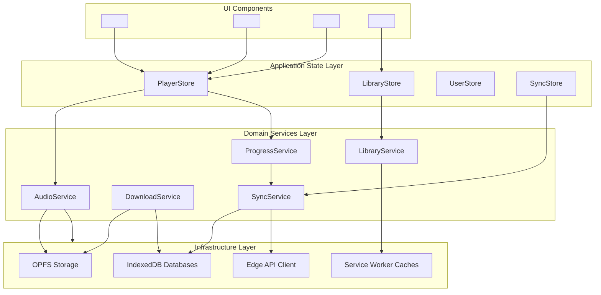

# VibeAudio Frontend Evolution Specification

**Document ID:** `SPEC-FE-001`  
**Status:** Canonical Implementation Specification  
**Version:** 1.0.0  
**Date:** September 13, 2026  
**Authors:** Senior Frontend Architect & Design Systems Lead, Antigravity Architecture Board  
**Target Repository:** `c:\Users\Suraj\Documents\Antigravity\VibeAudio`  
**Cross-References:** [`STITCH-DS-001`](../../.stitch/DESIGN.md), [`STITCH-SITE-001`](../../.stitch/SITE.md), [`ARCH-VIBE-001`](../architecture/VibeAudio-Target-Architecture.md), [`MP-VIBE-001`](../plans/VibeAudio-AI-Native-Frontend-Backend-Stitch-Evolution-Master-Plan.md)

---

## 4.1 Design System Architecture

VibeAudio adheres strictly to the **Light Editorial Sanctuary** design philosophy defined in [`.stitch/DESIGN.md`](../../.stitch/DESIGN.md). The design system bridges Stitch design definitions into executable, zero-build CSS custom properties.

```
┌────────────────────────────────────────────────────────────────────────┐
│                        DESIGN TOKEN FLOW CASCADE                       │
├────────────────────────────────────────────────────────────────────────┤
│ 1. Stitch Source of Truth: .stitch/DESIGN.md & .stitch/SITE.md         │
│    └── Defines colors, typography scales, squircle curvature, shadows  │
├────────────────────────────────────────────────────────────────────────┤
│ 2. CSS Variable Engine: frontend/src/css/tokens/                       │
│    ├── primitives.css (Raw hex codes, fundamental type curves)         │
│    ├── semantics.css  (Canvas, surfaces, contrast ratios, status roles)│
│    └── dimensions.css (Safe area insets, squircle radii, z-index stack)│
├────────────────────────────────────────────────────────────────────────┤
│ 3. Component Styling Layer: frontend/src/css/components/               │
│    └── Consumes semantic tokens; strictly enforces 2:3 card geometry   │
├────────────────────────────────────────────────────────────────────────┤
│ 4. Screen Layout Assemblies: frontend/src/pages/app.html & screens     │
│    └── 8 Canonical Views inheriting tokens via standard Light DOM      │
└────────────────────────────────────────────────────────────────────────┘
```

### 4.1.1 Color Palette & Contrast Calibration

Every color role is mathematically calibrated for glare-free daytime reading and strict WCAG 2.1 AA/AAA compliance. Pure black (`#000000`) and synthetic neon glows are strictly banned.

| Semantic Token Name | Hex / RGBA Value | Role & Usage | Contrast Ratio (WCAG) |
|---|---|---|---|
| `--color-canvas` | `#F5F5F7` | Global viewport background (Matte Apple Light Gray) | Baseline surface |
| `--color-surface-1` | `#FFFFFF` | Primary content cards, catalog book cards, dialogs | Baseline surface |
| `--color-surface-2` | `#F2F2F7` | Secondary surfaces, chapter list items, search inputs | Distinct from canvas |
| `--color-surface-3` | `#E5E5EA` | Hover state for secondary surfaces, card dividers | Hover state feedback |
| `--color-surface-translucent` | `rgba(255, 255, 255, 0.78)` | Floating topbar & mini-player dock with `backdrop-filter: blur(24px)` | Frosted glass depth |
| `--color-surface-overlay` | `rgba(245, 245, 247, 0.85)` | Modal sheet and backdrop scrim dimmer | Ambient focus |
| `--color-text-primary` | `#1D1D1F` | Book titles, section headlines, primary active controls | **13.5:1 on white / 12.8:1 on canvas** (AAA) |
| `--color-text-secondary` | `#6E6E73` | Author bylines, synopsis body copy, duration labels | **4.9:1 on white / 4.6:1 on canvas** (AA) |
| `--color-text-soft` | `#48484A` | Medium-emphasis labels, secondary button text | **8.2:1 on white** (AAA) |
| `--color-text-dim` | `#86868B` | Scrubber timecodes, chapter counts, inactive icons | $>3.0:1$ for graphical UI |
| `--color-text-muted` | `#AEAEB2` | Disabled buttons, hairline separator glyphs | Inactive states |
| `--color-accent` | `#C64E00` | Canonical Terracotta Amber: CTAs, active scrubber, badges | **4.67:1 with white text** (AA), 4.28:1 on canvas |
| `--color-accent-hover` | `#A84200` | Primary button hover interaction | **5.6:1 with white text** (AAA) |
| `--color-accent-active` | `#8F3900` | Primary button pressed state | **7.0:1 with white text** (AAA) |
| `--color-accent-soft` | `rgba(198, 78, 0, 0.08)` | Background for active category pills, active chapters | Subtle tint |
| `--color-accent-border` | `rgba(198, 78, 0, 0.24)` | Border for selected chips, focus ring outlines | Focus feedback |
| `--color-success` | `#248A3D` | Downloaded offline state, sync success indicator | $>4.5:1$ (AA) |
| `--color-warning` | `#C96E00` | Pending sync alert, storage quota warning | $>4.5:1$ (AA) |
| `--color-danger` | `#D70015` | Destructive action, delete offline audio, error alert | $>4.5:1$ (AA) |
| `--color-info` | `#0062CC` | Informational badges, system notices | $>4.5:1$ (AA) |

### 4.1.2 Typography Hierarchy

```
Newsreader (Transitional Serif) ──► Audiobook Titles, Section Eyebrows, Big Numbers
Inter (Modern Grotesque)       ──► UI Controls, Synopsis, Bylines, Navigation
JetBrains Mono (Tabular Mono)  ──► Scrubber Timecodes, Chapter Tallies, Storage Stats
```

* **Display Hero:** `clamp(2.4rem, 4.4vw, 3.8rem)` | Weight: 600 | Line-height: 1.06 | Tracking: `-0.035em` | Font: `'Newsreader', Georgia, serif`
* **Title 1 (Player Sanctuary):** `clamp(1.8rem, 3.2vw, 2.75rem)` | Weight: 600 | Line-height: 1.10 | Tracking: `-0.025em` | Font: `'Newsreader', Georgia, serif`
* **Title 2 (Shelf Header):** `1.35rem (21.6px)` | Weight: 600 | Line-height: 1.18 | Tracking: `-0.02em` | Font: `'Inter', sans-serif`
* **Title 3 (Card Headline):** `1.15rem (18.4px)` | Weight: 600 | Line-height: 1.20 | Tracking: `-0.015em` | Font: `'Inter', sans-serif` (2-line clamp)
* **Body Standard:** `0.94rem (15px)` | Weight: 400 | Line-height: 1.60 | Tracking: `-0.01em` | Font: `'Inter', sans-serif`
* **Body Medium / Actions:** `0.94rem (15px)` | Weight: 500 | Line-height: 1.50 | Tracking: `-0.01em` | Font: `'Inter', sans-serif`
* **Author Subtitle:** `0.84rem (13.5px)` | Weight: 500 | Line-height: 1.40 | Tracking: `0` | Font: `'Inter', sans-serif`
* **Timecode / Tabular:** `0.78rem (12.5px)` | Weight: 500 | Line-height: 1.20 | Tracking: `0.02em` | Font: `'JetBrains Mono', monospace` (`font-variant-numeric: tabular-nums`)
* **Kicker / Eyebrow:** `0.70rem (11.2px)` | Weight: 700 | Line-height: 1.10 | Tracking: `0.12em` | Font: `'Inter', sans-serif` (Uppercase)

### 4.1.3 Spacing, Radii, Shadows & Motion Scale

* **Spacing Steps:** `--space-1: 4px`, `--space-2: 8px`, `--space-3: 12px`, `--space-4: 16px`, `--space-5: 20px`, `--space-6: 24px`, `--space-8: 32px`, `--space-12: 48px`.
* **Border Radii (Squircle Curvature):**
  * `--radius-sm: 6px`: Badges, source chips.
  * `--radius-md: 10px`: Search inputs, chapter items, mini thumbnail.
  * `--radius-card: 14px`: Audiobook catalog cards, hero resume card.
  * `--radius-panel: 18px`: Full player transport deck, modal containers.
  * `--radius-sheet: 24px`: Topbar shell, floating mini-player dock.
  * `--radius-pill: 999px`: Buttons, category filters, scrubber thumb.
* **Elevation & Shadows:**
  * `--shadow-subtle: 0 2px 8px rgba(0, 0, 0, 0.04), 0 1px 2px rgba(0, 0, 0, 0.02)` (Catalog cards resting).
  * `--shadow-card: 0 6px 20px rgba(0, 0, 0, 0.05), 0 1px 4px rgba(0, 0, 0, 0.02)` (Card hover elevation).
  * `--shadow-elevated: 0 12px 32px rgba(0, 0, 0, 0.08), 0 2px 6px rgba(0, 0, 0, 0.03)` (Transport deck, modal).
  * `--shadow-dock: 0 16px 44px rgba(0, 0, 0, 0.10), 0 4px 12px rgba(0, 0, 0, 0.04)` (Floating mini-player dock).
  * `--shadow-focus: 0 0 0 3px rgba(198, 78, 0, 0.28)` (Keyboard accessible focus ring).
* **Motion & Spring Physics:**
  * `--transition-fast: 150ms cubic-bezier(0.2, 0, 0, 1)` (Button press, hover, toggle).
  * `--transition-base: 240ms cubic-bezier(0.2, 0, 0, 1)` (Card elevation, tab transition).
  * `--transition-smooth: 350ms cubic-bezier(0.4, 0, 0.2, 1)` (Drawer expand, player overlay toggle).
  * *Accessibility Rule:* When `prefers-reduced-motion: reduce` is active, all transitions instantly collapse to `0.01ms`.

---

## 4.2 CSS Architecture & Migration Plan

### 4.2.1 Audit of Existing 7 CSS Files

The current codebase in `frontend/src/css/` contains 7 separate CSS stylesheets representing 1,800+ lines of declarations:

| Existing CSS File | Lines | Byte Size | Responsibilities in As-Built Codebase | Identified Technical Debt & Overlap |
|---|---|---|---|---|
| [`base.css`](file:///c:/Users/Suraj/Documents/Antigravity/VibeAudio/frontend/src/css/base.css) | 1,076 | 26,181 B | Global variables, browser resets, typography, buttons, legacy utility overrides. | Monolithic file; mixes primitive tokens, layout rules, and legacy utility bridges. |
| [`app-sections.css`](file:///c:/Users/Suraj/Documents/Antigravity/VibeAudio/frontend/src/css/app-sections.css) | 512 | 17,744 B | Section layouts for `#view-home`, `#view-library`, `#view-offline`, `#view-profile`. | Hardcodes layout paddings that conflict with mini-dock bottom clearance. |
| [`components.css`](file:///c:/Users/Suraj/Documents/Antigravity/VibeAudio/frontend/src/css/components.css) | 682 | 25,609 B | Book cards, category pills, search bar, dialogs, hero card. | Mixes general primitives with view-specific cards; inconsistent radius values. |
| [`player.css`](file:///c:/Users/Suraj/Documents/Antigravity/VibeAudio/frontend/src/css/player.css) | 674 | 24,237 B | Mini-player dock (`#mini-player`) and full-screen player overlay (`#view-player`). | Contains duplicate scrubber styles that conflict with `player-premium.css`. |
| [`landing.css`](file:///c:/Users/Suraj/Documents/Antigravity/VibeAudio/frontend/src/css/landing.css) | 620 | 22,722 B | Styles for public landing page (`frontend/index.html`). | Scoped to landing page; repeats color variables rather than inheriting from base. |
| [`cover-media.css`](file:///c:/Users/Suraj/Documents/Antigravity/VibeAudio/frontend/src/css/cover-media.css) | 68 | 1,191 B | Book cover `aspect-ratio: 2/3`, image fit, thumbnail dimensions. | Small patch file created in Phase 5; should be consolidated into component card styles. |
| [`player-premium.css`](file:///c:/Users/Suraj/Documents/Antigravity/VibeAudio/frontend/src/css/player-premium.css) | 29 | 900 B | Scrubber focus enhancement, active chapter left-border indicator. | 29-line temporary patch; should be natively integrated into `player.css`. |

### 4.2.2 Target CSS Structure

The target architecture reorganizes styling into structured, single-responsibility layers:

```
frontend/src/css/
  ├── tokens/
  │    ├── primitives.css       /* Raw hex codes, raw spacing scale, font stacks */
  │    ├── semantics.css        /* Semantic color roles, contrast, status colors */
  │    └── dimensions.css       /* Squircle radii, elevation shadows, z-indices */
  ├── components/
  │    ├── cards.css            /* 2:3 book cards, hero resume card (absorbs cover-media.css) */
  │    ├── player.css           /* Mini dock, full player sanctuary (absorbs player-premium.css) */
  │    ├── navigation.css       /* Topbar frosted shell, mobile drawer */
  │    └── controls.css         /* Filter pills, search inputs, buttons, range scrubbers */
  ├── layouts/
  │    ├── app-sections.css     /* View section layouts, grid columns, bottom 120px clearance */
  │    └── landing.css          /* Public landing page presentation */
  └── base.css                  /* Resets, @font-face declarations, imports token/component bundle */
```

### 4.2.3 Migration Path & Rollback Strategy

1. **Step 1 (Token Extraction):** Extract `:root` variables from `base.css` into `tokens/primitives.css`, `tokens/semantics.css`, and `tokens/dimensions.css`. Import them at the top of `base.css` (`@import './tokens/primitives.css';`).
2. **Step 2 (Consolidate Patches):** Merge `cover-media.css` into `components/cards.css`. Merge `player-premium.css` into `components/player.css`.
3. **Step 3 (Precache Update):** Update Service Worker `PRECACHE_URLS` in `service-worker.js` with new file paths and bump `CACHE_VERSION` to `v15-modular-css`.
4. **Rollback Plan:** The legacy CSS files are preserved in git. If layout regression exceeds 0.5% in CI visual diffing, `index.html` and `app.html` `<link>` tags can immediately revert to legacy files without business logic impact.

---

## 4.3 Frontend State Architecture

VibeAudio implements five decoupled observable stores. Stores strictly manage in-memory state, expose immutable state snapshots, and reject direct DOM manipulation.

```
┌────────────────────────────────────────────────────────────────────────┐
│                        OBSERVABLE STORE TOPOLOGY                       │
├───────────────┬───────────────────────────────┬────────────────────────┤
│ Store Name    │ In-Memory State Managed       │ Persistence Linkage    │
├───────────────┼───────────────────────────────┼────────────────────────┤
│ `PlayerStore` │ Track, time, state, rate, vol │ LocalStorage (Resume)  │
│ `LibraryStore`│ Catalog, categories, filters  │ IndexedDB (Cached)     │
│ `UserStore`   │ Auth identity, preferences    │ LocalStorage / Clerk   │
│ `SyncStore`   │ Connection, pending sync tally│ IndexedDB sync queue   │
│ `UIStore`     │ Active view, modals, drawer   │ Ephemeral In-Memory    │
└───────────────┴───────────────────────────────┴────────────────────────┘
```

### 4.3.1 Store Specifications

#### 1. `PlayerStore`
* **State Shape:**
  ```typescript
  interface PlayerState {
      readonly currentBook: BookEntity | null;
      readonly activeChapterIndex: number;
      readonly playbackState: 'stopped' | 'buffering' | 'playing' | 'paused';
      readonly currentTimeSec: number;
      readonly durationSec: number;
      readonly playbackRate: number;      // 0.75, 1.0, 1.25, 1.5, 2.0
      readonly volume: number;            // 0.0 to 1.0
      readonly isMuted: boolean;
      readonly sleepTimerRemainingSec: number | null;
      readonly audioSourceType: 'stream' | 'opfs' | 'idb_blob' | 'youtube';
      readonly vocalBoosterActive: boolean;
  }
  ```
* **Actions:** `loadTrack(book, chapterIndex)`, `play()`, `pause()`, `seek(timeSec)`, `setPlaybackRate(rate)`, `setVolume(vol)`, `startSleepTimer(minutes)`, `cancelSleepTimer()`, `toggleVocalBooster()`.
* **Events Emitted:** `player-state-change`, `player-time-update`, `player-track-change`.
* **Consumers:** `<vibe-mini-player>`, `<vibe-player-deck>`, `<vibe-scrubber>`, `AudioService`, `ProgressService`.
* **Forbidden Responsibilities:** Must never invoke `document.getElementById` or call network APIs.

#### 2. `LibraryStore`
* **State Shape:**
  ```typescript
  interface LibraryState {
      readonly books: readonly BookEntity[];
      readonly genres: readonly string[];
      readonly activeGenre: string;       // 'all' or specific genre
      readonly searchQuery: string;
      readonly sortOrder: 'recent' | 'title' | 'author';
      readonly isLoading: boolean;
      readonly lastFetchedAt: string | null;
  }
  ```
* **Actions:** `setCatalog(books)`, `setGenreFilter(genre)`, `setSearchQuery(query)`, `setSortOrder(order)`, `setLoading(loading)`.
* **Events Emitted:** `library-catalog-updated`, `library-filter-changed`.
* **Consumers:** `#view-home`, `#view-library`, `<vibe-book-card>`.

#### 3. `UserStore`
* **State Shape:**
  ```typescript
  interface UserState {
      readonly userId: string;            // 'guest' or 'user_2abc...'
      readonly displayName: string;
      readonly isAuthenticated: boolean;
      readonly preferredLanguage: 'hi' | 'en';
      readonly playbackPreferences: {
          readonly defaultRate: number;
          readonly autoResume: boolean;
      };
  }
  ```
* **Actions:** `setUserSession(user)`, `clearSession()`, `setPreferredLanguage(lang)`, `updatePreferences(prefs)`.
* **Consumers:** `SyncService`, `AudioService`, `#view-profile`.

#### 4. `SyncStore`
* **State Shape:**
  ```typescript
  interface SyncState {
      readonly isOnline: boolean;
      readonly pendingSyncCount: number;
      readonly syncStatus: 'idle' | 'syncing' | 'synced' | 'error';
      readonly lastSyncTimestamp: string | null;
      readonly lastErrorReason: string | null;
  }
  ```
* **Actions:** `setOnlineStatus(boolean)`, `setPendingQueueCount(count)`, `setSyncStatus(status, error)`.
* **Consumers:** `<vibe-mini-player>`, `#view-profile`, Topbar network pill.

#### 5. `UIStore`
* **State Shape:**
  ```typescript
  interface UIState {
      readonly currentView: '#view-home' | '#view-library' | '#view-offline' | '#view-player' | '#view-profile';
      readonly isMiniPlayerVisible: boolean;
      readonly isDrawerOpen: boolean;
      readonly activeModalId: string | null;
      readonly toasts: readonly { id: string; message: string; type: 'info' | 'success' | 'warning' | 'error' }[];
  }
  ```
* **Actions:** `navigateTo(viewId)`, `toggleDrawer(isOpen)`, `openModal(modalId)`, `closeModal()`, `pushToast(msg, type)`, `dismissToast(id)`.
* **Consumers:** Application shell, navigation tabs, modal backdrops.

---

## 4.4 Domain Services Architecture

Domain services contain business rules and integrate Application Stores with the Infrastructure Layer.



### 4.4.1 AudioService
* **Inputs:** Book metadata, chapter index, target timestamp, playback rate.
* **Outputs:** HTML5 `<audio>` playback, DSP audio node graph, MediaSession lockscreen notifications.
* **State Ownership:** Controls low-level media hardware; synchronizes with `PlayerStore`.
* **Error Handling:** Transparently falls back to streaming URL if local OPFS blob URL fails validation.

### 4.4.2 DownloadService
* **Inputs:** Target book, chapter index, target language.
* **Outputs:** Progress byte streams, `.part` temporary OPFS handles, finalized `.bin` files, IndexedDB `offline_jobs` updates.
* **State Ownership:** Owns active download `AbortController` instances.
* **Offline Behavior:** Listens to `window.addEventListener('offline')`; safely aborts stream and checkpoints byte offset in IndexedDB.

### 4.4.3 ProgressService
* **Inputs:** Real-time audio time updates, completed track events.
* **Outputs:** Normalizes progress objects, calculates percentages, writes immediately to `localStorage` for latency-free cold start resume, forwards to `SyncService`.
* **Freshness Policy:** Monotonic LWW: rejects older incoming timestamps; protects finished books.

### 4.4.4 SyncService
* **Inputs:** Pending progress updates, auth change events, connectivity changes.
* **Outputs:** Batch payloads dispatched to `/api/v1/sync/batch`, IndexedDB `vibeaudio-sync-v1` writes/deletions.
* **Idempotency:** Generates `${userId}:${bookId}:${interactionTimestamp}` headers on all requests.

### 4.4.5 LibraryService
* **Inputs:** Search strings, category selections, catalog JSON payloads.
* **Outputs:** Filtered and sorted book arrays dispatched to `LibraryStore`.

---

## 4.5 Native Web Components Specification

All components are registered on `window.customElements` without Shadow DOM.

### 4.5.1 `<vibe-mini-player>`
* **Purpose:** Persistent 62px floating frosted glass audio transport dock hovering above bottom navigation.
* **DOM Structure:**
  ```html
  <vibe-mini-player class="player-bar mini-dock" role="region" aria-label="Audio Player Dock">
      <div class="mini-progress-line" style="width: 42%;"></div>
      <div class="mini-content-row">
          
          <div class="mini-meta">
              <span class="mini-title">Gitanjali: Song Offerings</span>
              <span class="mini-chapter">Song 1 • Rabindranath Tagore</span>
          </div>
          <div class="mini-transport">
              <button class="mini-btn" data-action="skip-back" aria-label="Rewind 15 seconds">
                  <svg class="icon"><use href="/src/icons/icons.svg#replay-15"></use></svg>
              </button>
              <button class="mini-play-circle" data-action="toggle-play" aria-label="Play">
                  <svg class="icon"><use href="/src/icons/icons.svg#play"></use></svg>
              </button>
              <button class="mini-btn" data-action="skip-forward" aria-label="Forward 30 seconds">
                  <svg class="icon"><use href="/src/icons/icons.svg#forward-30"></use></svg>
              </button>
          </div>
      </div>
  </vibe-mini-player>
  ```
* **Accessibility / ARIA:** `role="region"`, `aria-label="Audio Player Dock"`, `aria-live="polite"` for track changes.
* **Visibility Rule:** Automatically hides (`display: none`) when `#view-player` has the `.active` class.

### 4.5.2 `<vibe-player-deck>`
* **Purpose:** The tactile full player transport deck housing speed control, jump buttons, 56px play/pause button with ambient glow, and sleep timer trigger.
* **Events Dispatched:** `vibe-play-toggle`, `vibe-seek-jump`, `vibe-rate-change`, `vibe-timer-open`.

### 4.5.3 `<vibe-scrubber>`
* **Purpose:** High-precision audio progress scrubber with drag support and tabular timecodes.
* **DOM Attributes:** `value` (current seconds), `max` (total duration seconds), `buffered` (buffered percentage).
* **Typography:** Elapsed and remaining timecodes strictly styled with `JetBrains Mono` and `font-variant-numeric: tabular-nums`.

### 4.5.4 `<vibe-book-card>`
* **Purpose:** Canonical 2:3 vertical aspect ratio paperback card.
* **Public Attributes:** `book-id`, `title`, `author`, `cover`, `genre`, `downloaded`.
* **Interaction:** Squircle elevation on hover (`translateY(-3px)`), gentle cover scale (`1.02`), and keyboard focus outline.
