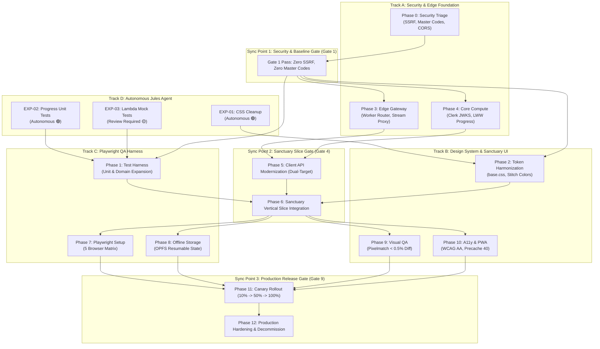

# VibeAudio Implementation Dependency Flow & Parallel Tracks Architecture
## Document ID: `GRAPH-001`

**Status:** Authoritative Engineering Baseline  
**Version:** 1.0.0  
**Date:** September 2026  
**Lead Authors:** Systems Architect, Principal Release Engineer, Technical Program Lead  
**Target Repository:** `c:\Users\Suraj\Documents\Antigravity\VibeAudio`  
**Cross-References:** [`ROADMAP-001`](./VibeAudio-Execution-Roadmap.md), [`QA-GATES-001`](../qa/VibeAudio-Release-Gates.md), [`AGENT-CAT-001`](../agents/VibeAudio-Jules-Task-Catalog.md)

---

## 1. Cross-Phase Dependency Flow Architecture

To maximize engineering velocity without compromising architectural integrity, the 13 roadmap phases are structured into **4 Non-Blocking Parallel Execution Tracks** anchored by **3 Rigid Synchronization Checkpoints**.



---

## 2. Comprehensive ASCII Dependency Flow

```
[Phase 0: Security Triage] (Track A)
       │
       ▼
 [SYNC POINT 1: Release Gate 1 (Security Baseline Verified)]
       ├───► [Phase 3: Edge Gateway] ──────────┐
       │     (Cloudflare Worker Router)        │
       │                                       ▼
       ├───► [Phase 4: Core Compute] ──► [Phase 5: Client API] ──┐
       │     (Clerk Auth & LWW)          (Dual-Target in api.js) │
       │                                                         │
       ├───► [Phase 2: Token Harmonization] ─────────────────────┼──► [SYNC POINT 2: Phase 6]
       │     (base.css & Stitch Colors)                          │    (Sanctuary Vertical Slice)
       │                                                         │               │
       └───► [Phase 1: Unit Test Harness] ───────────────────────┘               │
             (progress-model & lambda mocks)                                     │
                                                                                 ▼
 ┌───────────────────────────────────────────────────────────────────────────────┴────────────────────────┐
 │                                                                                                        │
 ▼                                       ▼                                       ▼                        ▼
[Phase 7: Playwright E2E]       [Phase 8: Offline OPFS]         [Phase 9: Visual QA]            [Phase 10: A11y & PWA]
(5 Browsers: Chrome, WebKit,     (Resumable Audio Chunks,        (Stitch Parity Snapshots,       (Lighthouse 100,
 Firefox, Pixel 5, iPhone 13)     SHA-256 Storage Engine)         Diff < 0.5% Tolerance)          Precache 40 Assets)
 │                                       │                                       │                        │
 └───────────────────────────────────────┬───────────────────────────────────────┴────────────────────────┘
                                         │
                                         ▼
                 [SYNC POINT 3: Release Gate 9 (Staging Smoke & Parity Passed)]
                                         │
                                         ▼
                 [Phase 11: Production Canary Shift (10% ➔ 50% ➔ 100%)]
                                         │
                                         ▼
                 [Phase 12: Production Hardening & Legacy Sunset]
```

---

## 3. Four Non-Blocking Parallel Execution Tracks

### Track A: Security & Edge Foundation
- **Focus**: Hardening compute, preventing SSRF, managing signed audio access, and routing edge traffic.
- **Independence**: Operates independently of UI layout changes. Does not touch CSS, DOM templates, or visual screens.
- **Key Milestones**:
  - `MS-A1`: SSRF closed in `proxymanager.js`, master bypass deleted from `auth.js`.
  - `MS-A2`: Cloudflare Worker edge router handles `/api/v1/catalog` with edge caching.
  - `MS-A3`: Lambda progress handlers verify Clerk JWKS and enforce LWW timestamp checks.

### Track B: Design System & Sanctuary UI
- **Focus**: Achieving 100% aesthetic and layout parity with Stitch screen specifications.
- **Independence**: Operates purely within CSS custom properties, typography stacks, and SVG icon vector assets. Does not block or depend on backend API refactoring.
- **Key Milestones**:
  - `MS-B1`: CSS token harmonization in `base.css` with `.stitch/DESIGN.md`.
  - `MS-B2`: Mini-player dock (62px) and full-player overlay (2:3 aspect ratio) alignment.
  - `MS-B3`: Chameleon dynamic palette saturation clamping ($S \le 35\%, L \ge 85\%$).

### Track C: Playwright & QA Infrastructure
- **Focus**: Building the automated verification harness across native Node test runner and Playwright.
- **Independence**: Can author tests against mock contracts and static HTML fixtures prior to backend completion.
- **Key Milestones**:
  - `MS-C1`: 100% branch coverage for `progress-model.js` and `user-data.js`.
  - `MS-C2`: Playwright configuration and local zero-build web server harness.
  - `MS-C3`: Multi-browser verification across Desktop Chromium, WebKit, Firefox, and Mobile devices.

### Track D: Autonomous Jules Agent Workflows
- **Focus**: Executing self-contained, low-to-medium risk tasks defined in `AGENT-CAT-001`.
- **Independence**: Executes in isolated cloud virtual machines; opens GitHub PRs reviewed asynchronously by Antigravity.
- **Key Milestones**:
  - `MS-D1`: Merge `EXP-01` (CSS token cleanup).
  - `MS-D2`: Merge `EXP-02` (Progress model unit tests).
  - `MS-D3`: Merge `EXP-03` (Lambda input validation and mock database tests).

---

## 4. Synchronization Checkpoints & Gate Blocker Matrix

| Checkpoint | Gate Trigger | Mandatory Requirements | Blocked Workstreams |
| :--- | :--- | :--- | :--- |
| **Sync Point 1** | `GATE-01` (Security) | SSRF closed, master codes deleted, CORS locked to `*.vibeaudio.pages.dev`. | Blocks Track A Phase 3, Phase 4, and public deployments. |
| **Sync Point 2** | `GATE-04` (Backend) | Sanctuary Vertical Slice passes 100%; catalog, stream proxy, and progress sync operational. | Blocks Playwright E2E suites and Canary rollout. |
| **Sync Point 3** | `GATE-09` (Release) | Playwright 100% passing across 5 browsers; Visual diff < 0.5%; Lighthouse A11y = 100. | Blocks 100% production cutover and legacy decommissioning. |

---

## 5. Critical Path Analysis & Contingency Buffers

1. **Critical Path**:
   `Phase 0 (Security)` ➔ `Phase 4 (Lambda Auth)` ➔ `Phase 5 (Client Dual-Target)` ➔ `Phase 6 (Vertical Slice)` ➔ `Phase 7 (Playwright Setup)` ➔ `Phase 11 (Canary)` ➔ `Phase 12 (Decommission)`
   - *Total Estimated Duration*: 28 working days.
2. **Float / Non-Critical Paths**:
   - Track B (CSS Harmonization): 14 days of float. Can proceed in parallel with Track A.
   - Track D (Jules Autonomous Tasks): Dispatched concurrently to cloud VMs without blocking local development.
3. **Contingency Buffers**:
   - A 5-day contingency buffer is inserted between `Phase 6 (Vertical Slice)` and `Phase 11 (Canary Rollout)` to absorb any browser-specific media autoplay or OPFS storage anomalies.
