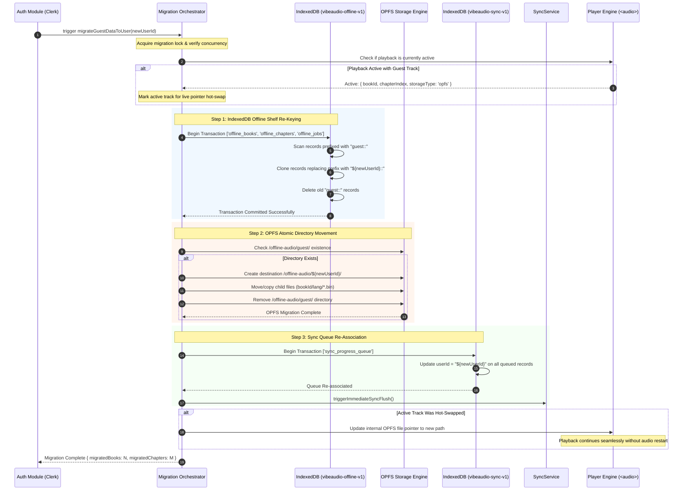

# VibeAudio Offline-First Evolution Specification

**Document ID:** `SPEC-OFFLINE-001`  
**Status:** Canonical Implementation Specification  
**Version:** 1.0.0  
**Date:** September 13, 2026  
**Authors:** Senior PWA & Offline Storage Architect, Antigravity Architecture Board  
**Target Repository:** `c:\Users\Suraj\Documents\Antigravity\VibeAudio`  
**Cross-References:** [`MP-VIBE-001`](../plans/VibeAudio-AI-Native-Frontend-Backend-Stitch-Evolution-Master-Plan.md), [`ARCH-VIBE-001`](../architecture/VibeAudio-Target-Architecture.md), [`SPEC-FE-001`](VibeAudio-Frontend-Evolution-Spec.md)

---

## 1. Architectural Scope & Problem Statement

VibeAudio is engineered around a **guest-first, offline-first** principle: listeners must be able to explore the catalog, stream chapters, save books offline, and keep listening progress without creating an account.

However, forensic audits in [`DOC-RES-001`](../research/VibeAudio-Frontend-Backend-Stitch-Architecture-Deep-Research.md) identified two severe flaws in the as-built offline implementation:
1. **Guest-to-Authenticated Data Abandonment:** Records in IndexedDB `vibeaudio-offline-v1` and file paths in the Origin Private File System (OPFS) are strictly keyed by `${userId}` (e.g., `guest::book123::hi`). When a guest signs in via Clerk, `userId` changes to `'user_2abc...'`. All previously downloaded audio, chapter records, and pending progress updates remain orphaned under `'guest'`, vanishing from the user's library.
2. **In-Memory Non-Resumable Chunk Downloads:** Downloads buffer response streams into an in-memory array (`chunks = []`). Network dropouts discard all received bytes, forcing downloads to restart from byte 0, exhausting mobile data plans.

This specification details the mathematical and structural solutions for both defects.

---

## 2. Subsystem A: Guest-to-User State Migration (`migrateGuestDataToUser`)

### 2.1 Sequence Architecture

When an unauthenticated guest listener signs in via Clerk, the client must atomically transfer all local data assets from the ephemeral `guest` identity to the new canonical `newUserId`.



### 2.2 Detailed Step-by-Step Implementation

#### Step 1: IndexedDB Re-Keying (`vibeaudio-offline-v1`)
The database contains three stores keyed by `userId`:
* `offline_books`: Primary key `${userId}::${bookId}::${lang}`.
* `offline_chapters`: Primary key `${userId}::${bookId}::${lang}::${chapterIndex}`.
* `offline_jobs`: Primary key `job::${userId}::${bookId}::${lang}::${chapterIndex}`.

**Migration Algorithm:**
```javascript
export async function migrateOfflineIndexedDB(guestUserId, newUserId) {
    const db = await openOfflineDatabase();
    return new Promise((resolve, reject) => {
        const tx = db.transaction(['offline_books', 'offline_chapters', 'offline_jobs', 'offline_storage_stats'], 'readwrite');
        tx.onerror = () => reject(tx.error);
        tx.oncomplete = () => resolve();

        const booksStore = tx.objectStore('offline_books');
        const chaptersStore = tx.objectStore('offline_chapters');
        const jobsStore = tx.objectStore('offline_jobs');
        const statsStore = tx.objectStore('offline_storage_stats');

        // Migrate books
        const bookReq = booksStore.index('by_user').openCursor(IDBKeyRange.only(guestUserId));
        bookReq.onsuccess = (event) => {
            const cursor = event.target.result;
            if (cursor) {
                const oldRecord = cursor.value;
                const newId = oldRecord.id.replace(`${guestUserId}::`, `${newUserId}::`);
                booksStore.put({ ...oldRecord, id: newId, userId: newUserId });
                cursor.delete();
                cursor.continue();
            }
        };

        // Migrate chapters
        const chapterReq = chaptersStore.index('by_user').openCursor(IDBKeyRange.only(guestUserId));
        chapterReq.onsuccess = (event) => {
            const cursor = event.target.result;
            if (cursor) {
                const oldRecord = cursor.value;
                const newId = oldRecord.id.replace(`${guestUserId}::`, `${newUserId}::`);
                const newOpfsPath = oldRecord.opfsPath 
                    ? oldRecord.opfsPath.replace(`offline-audio/${guestUserId}/`, `offline-audio/${newUserId}/`)
                    : oldRecord.opfsPath;
                chaptersStore.put({ ...oldRecord, id: newId, userId: newUserId, opfsPath: newOpfsPath });
                cursor.delete();
                cursor.continue();
            }
        };

        // Migrate jobs
        const jobsReq = jobsStore.index('by_user').openCursor(IDBKeyRange.only(guestUserId));
        jobsReq.onsuccess = (event) => {
            const cursor = event.target.result;
            if (cursor) {
                const oldJob = cursor.value;
                const newId = oldJob.id.replace(guestUserId, newUserId);
                jobsStore.put({ ...oldJob, id: newId, userId: newUserId });
                cursor.delete();
                cursor.continue();
            }
        };

        // Migrate stats
        statsStore.delete(`stats::${guestUserId}`);
    });
}
```

#### Step 2: OPFS Directory Atomic Movement
OPFS file hierarchies reside under `/offline-audio/${userId}/...`.
1. Retrieve root via `navigator.storage.getDirectory()`.
2. Inspect if `offline-audio` directory contains child `guest`.
3. If modern Chromium directory move is supported (`handle.move()`), perform atomic directory rename:
   ```javascript
   await guestDirHandle.move(audioRootDir, newUserId);
   ```
4. **Fallback Copy-and-Prune Loop (WebKit / Firefox / Older Chromium):**
   * Recursively walk `/offline-audio/guest/`.
   * Create matching directory tree under `/offline-audio/${newUserId}/`.
   * Stream source files to destination files via `createWritable()`.
   * Recursively delete `/offline-audio/guest/` entries.

#### Step 3: Sync Queue Re-Association & Immediate Flush
1. In `vibeaudio-sync-v1`, iterate all uncommitted records in `sync_progress_queue`.
2. Update `record.userId = newUserId`.
3. Update `record.id = buildPendingQueueKey(newUserId, record.bookId)`.
4. Trigger `SyncService.flushPendingSync()` immediately over the network to register the listener's progress on the server.

### 2.3 Concurrency, Rollback & Failure Recovery

* **Active Playback Concurrency:** If the listener is actively listening to an offline chapter while signing in, the audio element holds an in-memory `blob:` URL created via `URL.createObjectURL(file)`. The operating system file handle remains valid during rename. The `PlayerStore` is notified to update its internal path pointer to `/offline-audio/${newUserId}/...` without pausing playback.
* **Failure Recovery & Rollback:**
  * If the migration fails midway (e.g., browser tab closed during OPFS copy), the migration script leaves a `vibe_migration_pending: { from: 'guest', to: newUserId }` flag in `localStorage`.
  * On subsequent startup, `app-entry.js` detects the flag and safely resumes the migration from the last checkpoint before mounting UI views.
* **Idempotency:** The migration function is safe to execute multiple times. If `guest` contains zero records, it completes instantly with a no-op.

---

## 3. Subsystem B: Resumable Audio Downloads via HTTP Range

### 3.1 The Resumable Download Lifecycle

To prevent wasted mobile bandwidth and ensure downloads survive elevator rides, subway tunnels, and screen sleep events, VibeAudio implements HTTP Range chunk assembly directly onto the OPFS disk:

```
┌────────────────────────────────────────────────────────────────────────┐
│                      RESUMABLE DOWNLOAD LIFECYCLE                      │
├────────────────────────────────────────────────────────────────────────┤
│ 1. Job Creation:                                                       │
│    Record allocated in IndexedDB offline_jobs: status = 'queued'.      │
├────────────────────────────────────────────────────────────────────────┤
│ 2. Partial File Allocation:                                            │
│    Create/open /offline-audio/${userId}/${bookId}/${lang}/${ch}.part   │
├────────────────────────────────────────────────────────────────────────┤
│ 3. Byte Measurement:                                                   │
│    Inspect existing .part file size on disk: const offset = file.size  │
├────────────────────────────────────────────────────────────────────────┤
│ 4. Range HTTP Request:                                                 │
│    fetch(url, { headers: { Range: `bytes=${offset}-` } })              │
├────────────────────────────────────────────────────────────────────────┤
│ 5. Stream Append:                                                      │
│    writer.seek(offset);                                                │
│    while(chunk = await reader.read()) { writer.write(chunk); }         │
├────────────────────────────────────────────────────────────────────────┤
│ 6. Validation & Atomic Finalization:                                   │
│    Verify byte length and header checksum; close writer;               │
│    Atomically rename ${ch}.part ──► ${ch}.bin                          │
├────────────────────────────────────────────────────────────────────────┤
│ 7. State Update:                                                       │
│    IndexedDB chaptersStore: status = 'downloaded'; delete job record.  │
└────────────────────────────────────────────────────────────────────────┘
```

### 3.2 Detailed Step-by-Step Implementation

#### Step 1: Offset Measurement & Header Injection
```javascript
async function executeResumableDownload(job, chapterRecord) {
    const { userId, bookId, lang, chapterIndex } = job;
    const root = await navigator.storage.getDirectory();
    
    // Ensure directory hierarchy
    const dirHandle = await ensureOpfsDirectoryPath(root, ['offline-audio', userId, String(bookId), lang]);
    const partFileName = `${chapterIndex}.part`;
    const binFileName = `${chapterIndex}.bin`;

    // 1. Measure existing byte offset
    let existingOffset = 0;
    try {
        const existingPartHandle = await dirHandle.getFileHandle(partFileName, { create: false });
        const existingFile = await existingPartHandle.getFile();
        existingOffset = existingFile.size;
    } catch (_) {
        existingOffset = 0;
    }

    // 2. Formulate Range Request
    const headers = new Headers();
    if (existingOffset > 0) {
        headers.set('Range', `bytes=${existingOffset}-`);
    }

    const controller = new AbortController();
    const response = await fetch(chapterRecord.originalUrl, {
        headers,
        signal: controller.signal
    });

    // 3. Fallback handling for servers that do not support Range requests (HTTP 200)
    let startOffset = existingOffset;
    if (response.status === 200) {
        // Server ignored Range header and returned full payload from byte 0
        startOffset = 0;
    } else if (response.status === 416) {
        // Range Not Satisfiable: partial file already matches or exceeds remote size
        startOffset = 0;
    } else if (response.status !== 206) {
        throw new Error(`Download failed with unexpected HTTP status: ${response.status}`);
    }

    // 4. Stream chunks directly to OPFS disk via seek
    const partFileHandle = await dirHandle.getFileHandle(partFileName, { create: true });
    const writable = await partFileHandle.createWritable({ keepExistingData: startOffset > 0 });

    try {
        if (startOffset > 0) {
            await writable.seek(startOffset);
        }

        const reader = response.body.getReader();
        let totalLoaded = startOffset;
        const contentLength = Number(response.headers.get('content-length') || 0);
        const totalExpected = startOffset > 0 ? startOffset + contentLength : contentLength;

        while (true) {
            const { done, value } = await reader.read();
            if (done) break;

            await writable.write(value);
            totalLoaded += value.byteLength;

            // Throttle progress updates to IndexedDB to 500ms intervals
            await updateDownloadProgressThrottled(job, totalLoaded, totalExpected);
        }

        await writable.close();

        // 5. Atomic Rename .part to .bin
        const finalizedFile = await partFileHandle.getFile();
        if (finalizedFile.size === 0) {
            throw new Error('Downloaded audio binary was empty.');
        }

        // Copy/move part to bin
        const binFileHandle = await dirHandle.getFileHandle(binFileName, { create: true });
        const binWritable = await binFileHandle.createWritable();
        await binWritable.write(finalizedFile);
        await binWritable.close();

        // Delete temporary part file
        await dirHandle.removeEntry(partFileName);

        // 6. Finalize IndexedDB status
        await markChapterDownloaded(job, binFileName, finalizedFile.size);
    } catch (err) {
        try { await writable.abort(); } catch (_) {}
        throw err;
    }
}
```

---

## 4. Retries, Quotas & Cleanup Policies

### 4.1 Retry Schedule with Jitter
Network failures trigger retries managed by `JOB_RETRY_DELAYS_MS`:
* Attempt 1: 10 seconds $\pm$ 2 seconds random jitter.
* Attempt 2: 25 seconds $\pm$ 5 seconds random jitter.
* Attempt 3: 60 seconds $\pm$ 10 seconds random jitter.
* After 3 failed attempts: Mark job as `failed` with user-visible reason.

### 4.2 Partial File Cleanup Policies
* **Stale Partial Files:** Temporary `.part` files older than 72 hours without active download jobs are purged by a startup maintenance routine in `offline-shelf.js`.
* **Explicit Cancellation:** When a user cancels a download from the UI, the `.part` file handle is immediately deleted via `removeEntry(partFileName)`.

### 4.3 Quota Management & Eviction Prevention
1. Before commencing a download job, query `navigator.storage.estimate()`.
2. Ensure `(quota - usage) > (incomingAudioBytes * 1.5)`. If storage is insufficient, throw `QuotaExceededError` and emit a warning toast.
3. Proactively call `navigator.storage.persist()`. This instructs Chromium and WebKit to classify VibeAudio storage as persistent, shielding offline audiobooks from 7-day mobile browser eviction.
