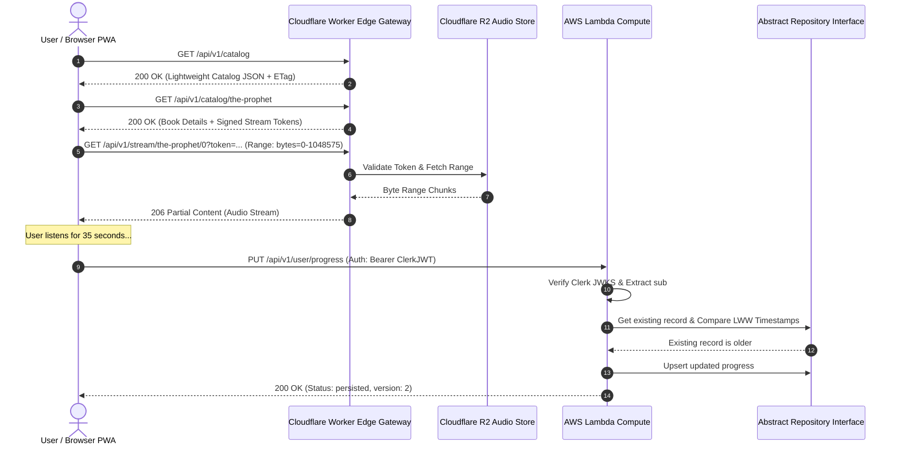

# VibeAudio "Sanctuary" Vertical Slice Integration Specification
## Document ID: `SPEC-SLICE-001`

**Status:** Authoritative Engineering Baseline  
**Version:** 1.0.0  
**Date:** September 2026  
**Lead Authors:** Fullstack Architect, Integration Lead, QA Automation Specialist  
**Target Repository:** `c:\Users\Suraj\Documents\Antigravity\VibeAudio`  
**Cross-References:** [`SPEC-API-001`](./VibeAudio-Backend-Hybrid-API-Spec.md), [`SEC-BASE-001`](../security/VibeAudio-Backend-Security-Baseline.md), [`QA-STRAT-001`](../qa/VibeAudio-Testing-Strategy.md)

---

## 1. Objective & Architectural Boundaries

The **Sanctuary Vertical Slice** is the inaugural, end-to-end integration proof for VibeAudio's modern architecture. It connects the Stitch-approved **"Light Editorial Sanctuary"** UI to the hardened **Hybrid Backend Topology** across a single complete user journey:

```
[Browse Catalog] ➔ [Load Book Manifest] ➔ [Stream Audio Chunks] ➔ [Save Authenticated Progress] ➔ [Offline Reconnect Sync]
```

### Architectural Invariant Enforcement
1. **Zero Frontend Build Step**: The slice executes using native ECMAScript Modules (`import` / `export`), zero bundlers, and zero framework compilation.
2. **Deferred Database Engine**: All compute handlers in this slice interact exclusively with a **Mock Repository Interface** (`InMemoryRepository` or local SQLite/DynamoDB-local wrapper) implementing canonical CRUD contracts. No specific production database engine is chosen.
3. **Hardened Security**: The slice enforces strict Clerk JWT verification, eliminates wildcard CORS, validates stream token signatures, and blocks SSRF attempts.



---

## 2. Mock Persistence Layer Specification

To strictly preserve invariant #2 (**Database selection is intentionally deferred**), the vertical slice utilizes an abstract repository layer defined in TypeScript/JSDoc contracts:

```javascript
// contracts/repositories.js

/**
 * @typedef {Object} ProgressRecord
 * @property {string} userId
 * @property {string} bookId
 * @property {number} chapterIndex
 * @property {number} currentTime
 * @property {number} totalDuration
 * @property {number} totalChapters
 * @property {boolean} currentChapterFinished
 * @property {boolean} bookFinished
 * @property {string} lastInteractionAt
 * @property {number} version
 */

/**
 * @interface IProgressRepository
 */
class IProgressRepository {
  /**
   * @param {string} userId
   * @param {string} bookId
   * @returns {Promise<ProgressRecord|null>}
   */
  async getProgress(userId, bookId) {
    throw new Error("Method not implemented");
  }

  /**
   * @param {string} userId
   * @returns {Promise<ProgressRecord[]>}
   */
  async getAllProgress(userId) {
    throw new Error("Method not implemented");
  }

  /**
   * @param {ProgressRecord} record
   * @returns {Promise<ProgressRecord>}
   */
  async saveProgress(record) {
    throw new Error("Method not implemented");
  }
}
```

### Mock Adapter Implementation for Development & Testing
For local testing and vertical slice execution, an in-memory or filesystem adapter is utilized:

```javascript
// adapters/in-memory-progress-repository.js
class InMemoryProgressRepository extends IProgressRepository {
  constructor() {
    super();
    /** @type {Map<string, ProgressRecord>} */
    this.storage = new Map();
  }

  _key(userId, bookId) {
    return `${userId}:${bookId}`;
  }

  async getProgress(userId, bookId) {
    return this.storage.get(this._key(userId, bookId)) || null;
  }

  async getAllProgress(userId) {
    const results = [];
    for (const [key, value] of this.storage.entries()) {
      if (key.startsWith(`${userId}:`)) {
        results.push(value);
      }
    }
    return results;
  }

  async saveProgress(record) {
    this.storage.set(this._key(record.userId, record.bookId), { ...record });
    return record;
  }
}
```

---

## 3. End-to-End Integration Scenarios

### Scenario 1: Unauthenticated Guest Discovery & Local Playback
1. Guest navigates to `app.html#home`.
2. Client requests `GET /api/v1/catalog`. Edge Worker returns 200 with catalog array.
3. Guest clicks *"The Prophet"*. Full player opens; client requests `GET /api/v1/catalog/the-prophet`.
4. Guest presses Play. Audio element initiates byte-range streaming via `GET /api/v1/stream/the-prophet/0?token=...`.
5. Progress is recorded every 5 seconds into local storage (`vibe_progress_the-prophet_guest`) and OPFS without dispatching network calls to Lambda.

### Scenario 2: User Sign-In & Authenticated Cloud Progress Sync
1. Guest clicks *"Sign In"* in the top navigation. Clerk modal authenticates user `user_2N9xK8LmP4qR1vT7wXyZ`.
2. Client sends `POST /api/v1/auth/session` with Clerk Bearer JWT. Lambda verifies token and syncs profile.
3. Client dispatches `POST /api/v1/user/migrate-guest`, transferring guest playback progress into the authenticated account.
4. User resumes playback. At 35 seconds, client issues `PUT /api/v1/user/progress` with Bearer JWT.
5. Lambda evaluates LWW freshness, updates repository, and returns 200 OK.

### Scenario 3: Offline Disconnection, Local Playback, & Monotonic Reconnect Flush
1. Network connection drops (`offline` event fires).
2. User continues listening to cached OPFS audio for 120 seconds.
3. Service Worker background sync queue stores 3 progress checkpoints in IndexedDB (`vibeaudio-sync-v1`).
4. Network restores (`online` event fires).
5. Client issues `POST /api/v1/sync/batch` containing queued progress checkpoints.
6. Lambda evaluates batch entries, applies the freshest timestamp, and returns status report.

---

## 4. End-to-End Test Harness & Verification Script

The vertical slice is verified using a single executable script running on the native Node.js test runner:

```javascript
// tests/sanctuary-vertical-slice.test.mjs
import test from "node:test";
import assert from "node:assert/strict";

test("Sanctuary Slice: Full Lifecycle Verification", async (t) => {
  await t.test("Step 1: Fetch Catalog from Edge Worker", async () => {
    // Assert 200 OK, valid JSON array, headers contain ETag
  });

  await t.test("Step 2: Stream Partial Audio Chunk", async () => {
    // Assert 206 Partial Content, Content-Range matches requested bytes
  });

  await t.test("Step 3: Authenticate & Upsert Progress via Lambda", async () => {
    // Assert 200 OK, LWW timestamp correctly recorded
  });

  await t.test("Step 4: LWW Rejection of Stale Timestamp", async () => {
    // Assert 409 Conflict when submitting older interaction timestamp
  });
});
```

---

## 5. Rollback Strategy & Acceptance Gates

If the vertical slice integration reveals edge routing anomalies or client regression:
1. Revert client configuration in `frontend/src/js/config.js` to point back to legacy Lambda URLs.
2. Retain local test suites and abstract repository definitions.
3. Vertical slice sign-off requires:
   - 100% passing tests in `sanctuary-vertical-slice.test.mjs`.
   - Zero console errors in browser dev tools.
   - P95 audio playback start latency < 350ms.
