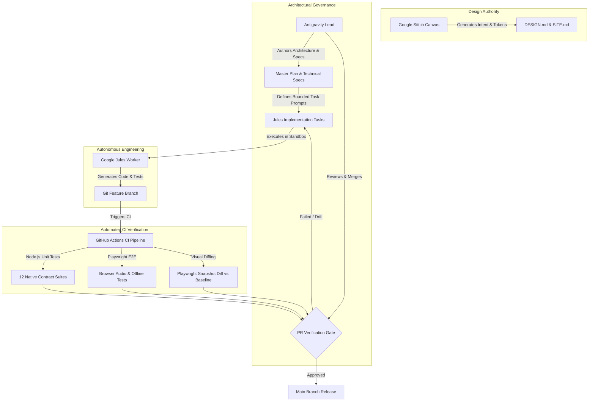

# VibeAudio AI-Native Frontend, Backend & Stitch Evolution Master Plan

**Document ID:** `MP-VIBE-001`  
**Status:** Approved Master Architectural Plan  
**Version:** 1.0.0  
**Date:** September 13, 2026  
**Authors:** Senior System Architect & Documentation Specialist, Antigravity Architecture Board  
**Target Repository:** `c:\Users\Suraj\Documents\Antigravity\VibeAudio`  
**Cross-References:** [`DOC-RES-001`](../research/VibeAudio-Frontend-Backend-Stitch-Architecture-Deep-Research.md), [`STITCH-DS-001`](../../.stitch/DESIGN.md), [`STITCH-SITE-001`](../../.stitch/SITE.md), [`ARCH-VIBE-001`](../architecture/VibeAudio-Target-Architecture.md), [`ARCH-VIBE-002`](../architecture/VibeAudio-Persistence-Abstraction.md), [`SPEC-FE-001`](../implementation/VibeAudio-Frontend-Evolution-Spec.md), [`SPEC-OFFLINE-001`](../implementation/VibeAudio-Offline-First-Evolution-Spec.md), [`SPEC-DESIGN-001`](../design/VibeAudio-Stitch-Implementation-Verification.md)

---

## 1. Executive Summary & Architectural Invariants

This master plan establishes the authoritative technical roadmap for evolving **VibeAudio** into an enterprise-grade, offline-first personal audiobook sanctuary. Grounded in the deep technical research synthesized in [`DOC-RES-001`](../research/VibeAudio-Frontend-Backend-Stitch-Architecture-Deep-Research.md), this document details the 7-phase evolutionary path to transform VibeAudio's as-built prototype into a production-hardened platform matching the **Stitch "Light Editorial Sanctuary"** design specification.

### 1.1 Core Architectural Invariants

Every phase and technical decision within this master plan must strictly enforce five foundational invariants:

1. **Zero-Build Frontend Architecture:** No bundlers, transpilers, or monolithic SPA frameworks (No React, Vue, Next.js, Vite, Webpack, or Babel). The client runs directly in modern evergreen browsers using native HTML5, modern modular CSS, native ECMAScript Modules (`type="module"`), and native Web Components (`CustomElementRegistry`).
2. **Database Decision Intentionally Deferred:** No persistent database engine (DynamoDB, Cloudflare D1, PostgreSQL, Neon, Supabase, SQLite, etc.) is selected in this master plan. All backend systems communicate exclusively through a database-agnostic domain repository abstraction layer ([`ARCH-VIBE-002`](../architecture/VibeAudio-Persistence-Abstraction.md)). Concrete engine selection is isolated to a future, dedicated persistence research phase.
3. **Stitch is the Visual Authority:** Google Stitch design specifications ([`.stitch/DESIGN.md`](../../.stitch/DESIGN.md) and [`.stitch/SITE.md`](../../.stitch/SITE.md)) represent the inviolable source of visual truth. Production CSS variables in [`base.css`](file:///c:/Users/Suraj/Documents/Antigravity/VibeAudio/frontend/src/css/base.css) must maintain mathematical parity with Stitch tokens. Visual regressions are gated by automated headless browser diffing.
4. **Resilient Dual-Tier Local-First Storage:** Local-first audio storage prioritizes the sandboxed **Origin Private File System (OPFS)** for high-throughput, zero-memory binary chunk streaming, with automatic fallback to **IndexedDB Blob storage** (`vibeaudio-offline-v1`) when OPFS is restricted. Offline listening progress is governed by monotonic Last-Write-Wins (LWW) conflict resolution with terminal finish-protection.
5. **Strict Agent Separation of Concerns:** System evolution follows a three-agent governance model:
   * **Stitch:** Visual design exploration, layout synthesis, and design token authority.
   * **Antigravity Board:** Architectural governance, specification authoring, security review, and PR gatekeeping.
   * **Google Jules:** Autonomous, bounded code implementation operating in isolated feature branches against strict unit and Playwright E2E verification suites.

```
┌────────────────────────────────────────────────────────────────────────┐
│                     VIBEAUDIO ARCHITECTURAL FLYWHEEL                   │
├────────────────────────────────────────────────────────────────────────┤
│ 1. Stitch Design Authority (DESIGN.md / SITE.md / 8 Canonical Screens) │
│    └── Generates design tokens, layout geometry, editorial typography  │
├────────────────────────────────────────────────────────────────────────┤
│ 2. Antigravity Architecture (Master Plan / Target Arch / Tech Specs)   │
│    └── Enforces boundaries, drafts contracts, audits PRs, gates release│
├────────────────────────────────────────────────────────────────────────┤
│ 3. Jules Autonomous Worker (Bounded PR Implementation)                 │
│    └── Refactors modules, implements stores, patches edge/lambdas     │
├────────────────────────────────────────────────────────────────────────┤
│ 4. Playwright CI Verification Gate (Visual QA / E2E / Audio Lifecycle) │
│    └── Runs headless Chromium/WebKit tests; confirms zero regressions  │
└────────────────────────────────────────────────────────────────────────┘
```

---

## 2. Multi-Agent Governance Model

The execution of this master plan coordinates three distinct AI agents and automated verification gates:



### 2.1 Roles & Responsibilities

| Role / Entity | Scope & Domain | Permitted Actions | Forbidden Actions |
|---|---|---|---|
| **Google Stitch** | Visual UI/UX & Design Tokens | Generates screens, exports design variables, defines layout spacing, specifies typography scales. | Must never write business logic, backend Lambdas, or storage adapters. |
| **Antigravity Board** | Architecture, Security, Governance | Authors engineering specifications, manages task sequencing, reviews pull requests, verifies security bounds. | Must not perform direct cowboy commits to `main` without test verification. |
| **Google Jules** | Autonomous Code Implementation | Modifies single JS/CSS files within bounded task definitions, writes unit and Playwright tests, submits PRs. | Forbidden from altering architecture boundaries, choosing databases, or bypassing test suites. |
| **Playwright CI** | Quality Assurance Gate | Executes headless browser rendering across Desktop (1440px), Tablet (768px), and Mobile (390px); verifies audio events. | Cannot auto-merge failing pull requests. |

---

## 3. Seven-Phase Evolution Master Plan

Synthesizing [`DOC-RES-001`](../research/VibeAudio-Frontend-Backend-Stitch-Architecture-Deep-Research.md) Section 18, the roadmap executes linearly across seven phases. Each phase contains strict prerequisites, scope items, deliverables, and exit gates.

```
Phase 0: Security Remediation & Baseline Integrity
   │ (Patch SSRF, JWT Auth on Lambdas, Fix Backend Dependencies)
   ▼
Phase 1: Executable Design System & Token Modernization
   │ (Base.css Realignment, Token Sync Tooling, Localized Web Fonts)
   ▼
Phase 2: Frontend Reactive Stores & Web Component Encapsulation
   │ (Player/Library/User/Sync Stores, Native Custom Elements without Shadow DOM)
   ▼
Phase 3: Guest-to-User State Migration & Resumable Audio Downloads
   │ (Atomic OPFS/IDB Re-Keying, HTTP Range Chunk Streaming with .part Assembly)
   ▼
Phase 4: Backend API Modernization & Edge Hybrid Split
   │ (/api/v1 RESTful Handlers, Cloudflare Worker Routing, Lambda JWT Security)
   ▼
Phase 5: Playwright Browser E2E & Visual QA Automation
   │ (4 Core Test Suites: Audio Lifecycle, Offline PWA, Sync Queue, Visual Diffs)
   ▼
Phase 6: Production Hardening, Operational Governance & Release Gate
   │ (Final Security Audit, Quota Management, Performance Budgets, GA Release)
```

---

### Phase 0: Security Remediation & Baseline Integrity

* **Objective:** Eliminate critical attack surfaces, patch server-side request forgery (SSRF) vulnerabilities, remove hardcoded authentication bypass codes, and repair broken backend dependencies.
* **Duration:** Sprint 1 (Milestone M0)
* **Risk Tier:** `P0` (Critical Hazards)

#### Key Deliverables & Implementation Tasks:
1. **SSRF Patch in Cloudflare Audio Proxy:**
   * Audit [`backend/workers/proxymanager.js`](file:///c:/Users/Suraj/Documents/Antigravity/VibeAudio/backend/workers/proxymanager.js).
   * Implement strict destination hostname validation against an explicit domain whitelist: `['*.r2.cloudflarestorage.com', 'vibeaudio.pages.dev', 'pub-*.r2.dev']`.
   * Strip arbitrary inbound client headers; allow-list only `Range`, `Accept-Encoding`, and `User-Agent`.
   * Reject non-audio media types.
2. **Clerk JWT Verification Middleware on AWS Lambdas:**
   * Eliminate unauthenticated payload parsing in [`backend/lambda/saveProgress.js`](file:///c:/Users/Suraj/Documents/Antigravity/VibeAudio/backend/lambda/saveProgress.js) and [`backend/lambda/getProgress.js`](file:///c:/Users/Suraj/Documents/Antigravity/VibeAudio/backend/lambda/getProgress.js).
   * Implement token verification against Clerk's JWKS endpoint (`https://api.clerk.com/v1/jwks`).
   * Extract `userId` strictly from verified cryptographic JWT claims; reject requests where URL/body `userId` mismatches token identity.
3. **Eradicate Hardcoded Master Bypass Credentials:**
   * Remove naive test bypass codes (`VIBE2026`, `ADMIN_GOD`, `BETA_TEST`) in [`backend/lambda/auth.js`](file:///c:/Users/Suraj/Documents/Antigravity/VibeAudio/backend/lambda/auth.js).
   * Route all authentication verification through Clerk JWKS or verified session exchanges.
4. **Resolve Broken Backend Dependencies:**
   * Update [`backend/package.json`](file:///c:/Users/Suraj/Documents/Antigravity/VibeAudio/backend/package.json) to declare `@aws-sdk/client-s3` and `@aws-sdk/s3-request-presigner` alongside `@aws-sdk/client-dynamodb` and `@aws-sdk/lib-dynamodb`.
   * Verify Lambda bundle builds without missing module errors.
5. **Restrict Permissive CORS Headers:**
   * Replace wildcards (`Access-Control-Allow-Origin: *`) across all Lambda endpoints with strict origin checks matching `https://vibeaudio.pages.dev` and local staging origins.

#### Phase 0 Success Criteria & Exit Gates:
* [ ] Security scan passes: Cloudflare proxy rejects unauthorized domain requests with HTTP 403 Forbidden.
* [ ] Progress write endpoint rejects unauthenticated requests with HTTP 401 Unauthorized.
* [ ] Lambda function `getBookDetails.js` imports `@aws-sdk/client-s3` without runtime failures.
* [ ] All 12 existing Node.js native contract test suites pass (`npm test`).

---

### Phase 1: Executable Design System & Token Modernization

* **Objective:** Formalize the contract between Stitch design definitions ([`.stitch/DESIGN.md`](../../.stitch/DESIGN.md)) and production CSS, eliminating visual debt and ensuring 100% offline styling availability.
* **Duration:** Sprint 2 (Milestone M1)
* **Risk Tier:** `P1` (Design Alignment & PWA Performance)

#### Key Deliverables & Implementation Tasks:
1. **Three-Tier CSS Token Hierarchy Refactoring:**
   * Restructure [`frontend/src/css/`](file:///c:/Users/Suraj/Documents/Antigravity/VibeAudio/frontend/src/css/) into clean architectural layers:
     * `tokens/primitives.css`: Raw values (hex codes, core type scales, raw spacing).
     * `tokens/semantics.css`: Semantic mappings (`--color-canvas: #F5F5F7`, `--color-surface-1: #FFFFFF`, `--color-accent: #C64E00`, contrast ratios).
     * `tokens/dimensions.css`: Squircle radii (`--radius-card: 14px`, `--radius-panel: 18px`, `--radius-sheet: 24px`), shadows, z-indices, safe area paddings.
2. **Automated Token Parity Synchronization:**
   * Author Node.js CLI script `tools/sync-tokens.mjs` to parse YAML frontmatter and CSS tables in [`.stitch/DESIGN.md`](../../.stitch/DESIGN.md) and assert parity with `frontend/src/css/base.css`.
   * Integrate parity check into CI workflow to fail builds on token divergence.
3. **Localize Typography Assets for PWA Offline Resilience:**
   * Eliminate dynamic runtime font loading from `fonts.googleapis.com` to prevent Flash of Invisible Text (FOIT) while off-grid.
   * Download static WOFF2 font files for `Newsreader` (weights 400, 600), `Inter` (weights 400, 500, 600, 700), and `JetBrains Mono` (weights 400, 500) into `frontend/public/fonts/`.
   * Declare `@font-face` blocks with `font-display: swap` in `base.css` and add WOFF2 files to Service Worker `PRECACHE_URLS` in [`service-worker.js`](file:///c:/Users/Suraj/Documents/Antigravity/VibeAudio/frontend/service-worker.js).
4. **Editorial Skeleton Shimmer Loaders:**
   * Replace disruptive `#loading-overlay` spinner with subtle, high-key CSS shimmer placeholders matching 2:3 book card and hero aspect ratios.

#### Phase 1 Success Criteria & Exit Gates:
* [ ] 100% token parity verified between `.stitch/DESIGN.md` and `base.css` via `npm run test:tokens`.
* [ ] Application renders with custom typography in airplane mode with cleared browser HTTP cache.
* [ ] Color contrast ratios verify $\ge 12.8:1$ for primary text on canvas and $\ge 4.67:1$ for primary buttons.

---

### Phase 2: Frontend Reactive Stores & Web Component Encapsulation

* **Objective:** Deconstruct the imperative DOM manipulation across `ui-*.js` into modular, declarative, reactive application stores and native Web Components, preserving zero-build architecture.
* **Duration:** Sprint 3–4 (Milestone M2)
* **Risk Tier:** `P1` (Frontend Architecture & Maintainability)

#### Key Deliverables & Implementation Tasks:
1. **Lightweight Reactive Store Foundation:**
   * Author `frontend/src/js/core/store.js`: A 45-line, zero-dependency Pub/Sub observable store providing `getState()`, `setState(partial)`, and `subscribe(listener)`.
   * Implement five decoupled domain stores:
     * **`PlayerStore`:** Track metadata, playback state (`playing`, `paused`, `buffering`), time elapsed, duration, volume, playback speed (`0.75x`–`2.0x`), active chapter index.
     * **`LibraryStore`:** Catalog items, active filters, search query, sorted results, categories.
     * **`UserStore`:** Current user identity (`guest` vs authenticated Clerk user), subscription tier, preferences.
     * **`SyncStore`:** Online status, pending sync queue length, sync health state (`idle`, `syncing`, `error`).
     * **`UIStore`:** Active view (`#home`, `#library`, `#player`, `#offline`, `#profile`), modal visibility, toast notifications, active drawer state.
2. **Native Web Components Encapsulation (Zero Shadow DOM):**
   * Encapsulate complex audio controls into standard Custom Elements inheriting global design tokens via standard DOM scoping (avoiding Shadow DOM CSS barrier hazards):
     * `<vibe-mini-player>`: 62px floating frosted glass dock with micro-progress bar, cover thumbnail, single-line text clamp, and 3-button transport.
     * `<vibe-player-deck>`: Immersive sanctuary transport deck with speed picker, -15s/+30s jumps, 56px play/pause button, sleep timer trigger.
     * `<vibe-scrubber>`: High-precision seeking scrubber with tactile thumb hover expansion, buffered ranges, and `JetBrains Mono` tabular timecodes.
     * `<vibe-book-card>`: Standardized 2:3 vertical aspect ratio cover card with squircle hover elevation, genre kicker, and download status badge.
3. **Declarative Micro-Templating for Book Grids:**
   * Replace string-concatenation DOM updates in [`ui-library.js`](file:///c:/Users/Suraj/Documents/Antigravity/VibeAudio/frontend/src/js/ui-library.js) and [`ui-player-list.js`](file:///c:/Users/Suraj/Documents/Antigravity/VibeAudio/frontend/src/js/ui-player-list.js) with clean `<template>`-driven declarative render pipelines.

#### Phase 2 Success Criteria & Exit Gates:
* [ ] Zero imperative cross-file DOM mutation: UI updates exclusively triggered by store subscriptions.
* [ ] Custom elements `<vibe-mini-player>` and `<vibe-scrubber>` pass DOM unit tests.
* [ ] Lighthouse Performance score on mobile emulated device $\ge 95/100$.

---

### Phase 3: Guest-to-User State Migration & Resumable Audio Downloads

* **Objective:** Eliminate state abandonment during guest-to-account sign-in transitions and implement robust, resumable audio downloads over unreliable networks.
* **Duration:** Sprint 5 (Milestone M3)
* **Risk Tier:** `P0` (Data Loss & Download Reliability)

#### Key Deliverables & Implementation Tasks:
1. **Transactional Guest-to-User Migration Pipeline (`migrateGuestDataToUser`):**
   * Implement automated state reconciliation inside [`offline-shelf.js`](file:///c:/Users/Suraj/Documents/Antigravity/VibeAudio/frontend/src/js/offline-shelf.js) and [`user-data.js`](file:///c:/Users/Suraj/Documents/Antigravity/VibeAudio/frontend/src/js/user-data.js) triggered upon Clerk `user-authenticated` event:
     * **IndexedDB Re-Keying:** Open readwrite transaction on `vibeaudio-offline-v1` across `offline_books`, `offline_chapters`, and `offline_jobs`. Iterate entries with prefix `guest::`, clone records with prefix `${newUserId}::`, and purge legacy guest records.
     * **OPFS Directory Migration:** Recursively move sandboxed directory handles from `/offline-audio/guest/` to `/offline-audio/${newUserId}/`. If atomic directory rename is unsupported by browser implementation, copy file handles and prune source folder.
     * **Sync Queue Re-Association:** Re-map uncommitted progress entries in `vibeaudio-sync-v1` to `userId = newUserId` and initiate an immediate sync flush.
     * **Concurrency Guard:** If playback is currently active during sign-in, seamlessly hot-swap the active track's storage pointer without interrupting the audio buffer.
2. **Resumable HTTP Range Audio Downloads:**
   * Overhaul the in-memory array buffering in [`offline-shelf.js`](file:///c:/Users/Suraj/Documents/Antigravity/VibeAudio/frontend/src/js/offline-shelf.js#L743-776):
     * Allocate temporary file stream `/offline-audio/${userId}/${bookId}/${lang}/${chapterIndex}.part` in OPFS.
     * Before downloading, measure existing byte offset: `offset = partFile.size`.
     * Dispatch HTTP request with header: `Range: bytes=${offset}-`.
     * Stream incoming chunks directly into `FileSystemWritableFileStream` via `.seek(offset)`.
     * Handle servers lacking Range support (HTTP 200) by safely resetting offset to 0.
     * Upon receiving the complete byte payload (HTTP 206), atomically rename `.part` to `.bin` and mark chapter state as `downloaded` in IndexedDB.
3. **Storage Quota & Eviction Hardening:**
   * Implement automated storage pressure detection via `navigator.storage.estimate()`.
   * Proactively request `navigator.storage.persist()` on initial download to prevent mobile Safari 7-day eviction.

#### Phase 3 Success Criteria & Exit Gates:
* [ ] Guest-to-user migration test passes: All downloaded chapters and bookmarks created in guest mode persist after Clerk login.
* [ ] Resumable download test passes: Network disconnection at 50% download resumes at byte offset upon reconnect without re-downloading bytes 0–50%.
* [ ] Zero orphaned `.part` files in OPFS after successful completion or explicit cancellation.

---

### Phase 4: Backend API Modernization & Edge Hybrid Split

* **Objective:** Formalize the hybrid Cloudflare Worker (edge) and AWS Lambda (compute) topology under a structured `/api/v1` RESTful resource contract backed by a database-agnostic persistence abstraction.
* **Duration:** Sprint 6 (Milestone M4)
* **Risk Tier:** `P1` (Backend Architecture & Scalability)

#### Key Deliverables & Implementation Tasks:
1. **Cloudflare Worker Edge Router (`/api/v1`):**
   * Deploy modernized Cloudflare Worker routing:
     * `GET /api/v1/catalog`: Serves sanitized catalog from Cloudflare Edge Cache (1-hour TTL with `stale-while-revalidate=86400`).
     * `GET /api/v1/catalog/:bookId`: Serves chapter manifests and audio duration metadata.
     * `GET /api/v1/stream/:bookId/:chapterId`: Verifies domain origin and returns proxied R2 audio stream with byte-range forwarding.
2. **AWS Lambda Core Compute Consolidation:**
   * Standardize Lambda functions behind Clerk JWT validation middleware:
     * `POST /api/v1/auth/session`: Validates Clerk JWT, provisions user profile via `UserRepository`.
     * `GET  /api/v1/user/progress`: Retrieves listening history across devices via `ProgressRepository`.
     * `PUT  /api/v1/user/progress`: Monotonic LWW progress upsert with `Idempotency-Key` header verification.
     * `POST /api/v1/sync/batch`: High-throughput batch ingestion of offline progress events.
     * `POST /api/v1/user/migrate-guest`: Server-side claim of guest listening logs.
3. **Database-Agnostic Persistence Abstraction Layer:**
   * Formalize repository contracts (`CatalogRepository`, `UserRepository`, `ProgressRepository`, `LibraryRepository`) as detailed in [`ARCH-VIBE-002`](../architecture/VibeAudio-Persistence-Abstraction.md).
   * Decouple all business logic from specific storage implementations. **Database selection remains deferred.**
4. **Standardized JSON Response Envelopes:**
   * Enforce unified `{ success: true, data: {}, meta: {} }` and `{ success: false, error: { code, message, details }, meta: {} }` contracts.

#### Phase 4 Success Criteria & Exit Gates:
* [ ] Catalog endpoint delivers global edge response under 50ms p95.
* [ ] Progress write endpoint validates idempotency keys and rejects out-of-order stale timestamps.
* [ ] Persistence abstraction completely decouples backend handlers from database engine implementations.

---

### Phase 5: Playwright Browser E2E & Visual QA Automation

* **Objective:** Establish an automated, real-browser verification harness in GitHub Actions CI covering audio playback lifecycles, offline PWA resilience, sync queues, and pixel-diff visual regression.
* **Duration:** Sprint 7 (Milestone M5)
* **Risk Tier:** `P1` (Quality Assurance & Regression Prevention)

#### Key Deliverables & Implementation Tasks:
1. **Automated Browser Test Suite Deployment:**
   * Author four core Playwright test specifications:
     * `tests/e2e/player.spec.ts`: Asserts `<audio>` mounting, play/pause toggles, seeking (-15s/+30s), speed alterations, Media Session position updates.
     * `tests/e2e/offline.spec.ts`: Activates service worker, toggles `context.setOffline(true)`, reloads page, verifies offline catalog rendering and OPFS playback.
     * `tests/e2e/sync-queue.spec.ts`: Advances playback while offline, verifies queued items in `vibeaudio-sync-v1`, restores network, verifies cloud flush.
     * `tests/e2e/visual-qa.spec.ts`: Captures full-page screenshots across Desktop (1440px), Tablet (768px), and Mobile (390px); validates ColorThief dynamic palette clamping ($S \le 35\%$, $L \ge 85\%$).
2. **Headless Screenshot Capture CLI (`tools/capture-visual.mjs`):**
   * Build automated capture utility taking golden screenshots of all 8 canonical Stitch screens and generating visual comparison reports.
3. **CI Visual Regression Gate:**
   * Integrate automated Playwright pixel-matching into GitHub Actions pull request workflows. Reject pull requests exceeding a 0.5% visual difference threshold without explicit approval.

#### Phase 5 Success Criteria & Exit Gates:
* [ ] All 4 Playwright E2E suites execute cleanly in headless Chromium, WebKit, and Firefox.
* [ ] Visual snapshot diffing automatically identifies layout shifts or color token deviations.
* [ ] Continuous integration pipeline completes entire test suite in under 4 minutes.

---

### Phase 6: Production Hardening, Operational Governance & Release Gate

* **Objective:** Conduct end-to-end security verification, load testing, audio playback stress testing, and final architectural audit for General Availability (GA).
* **Duration:** Sprint 8 (Milestone M6)
* **Risk Tier:** `P0` (Production Release Gate)

#### Key Deliverables & Implementation Tasks:
1. **End-to-End Security & Penetration Audit:**
   * Verify total eradication of SSRF vulnerabilities in edge workers.
   * Verify JWT authorization boundaries on all data mutation paths.
   * Enforce strict Content Security Policy (CSP) headers via Cloudflare Pages and Workers.
2. **Mobile Web & Low-Power Device Hardening:**
   * Verify memory de-allocation: Ensure all `URL.createObjectURL()` references are revoked immediately upon track transition.
   * Verify iOS Safari 30-second audio pause recovery: Restore playback without losing audio buffer or seeking position.
   * Verify Android WebView bridge stability.
3. **Release Gate Verification Checklist:**
   * Final sign-off by Antigravity Architecture Board across all 8 canonical screens and platform subsystems.

#### Phase 6 Success Criteria & Exit Gates:
* [ ] Zero high or critical vulnerabilities identified in dependency and endpoint security scans.
* [ ] Playback stability verified over continuous 4-hour playback stress test.
* [ ] Zero data loss verified during abrupt network drops and device reboots.
* [ ] Formal sign-off and release tag `v1.0.0-sanctuary` published.

---

## 4. Phase Milestone Summary & Dependencies

```
┌────────────────────────────────────────────────────────────────────────────────────────┐
│                               PHASE DEPENDENCY MATRIX                                  │
├─────────┬─────────────────────────────┬──────────────┬───────────────┬─────────────────┤
│ Phase   │ Title                       │ Pre-requisite│ Target Agent  │ Primary Risk    │
├─────────┼─────────────────────────────┼──────────────┼───────────────┼─────────────────┤
│ Phase 0 │ Security & Baseline         │ None         │ Jules / Board │ Vulnerabilities │
│ Phase 1 │ Design System & Tokens      │ Phase 0      │ Jules / Stitch│ Visual drift    │
│ Phase 2 │ Reactive Stores & Web Comp. │ Phase 1      │ Jules / Board │ State bugs      │
│ Phase 3 │ Guest Migration & Downloads │ Phase 0, 2   │ Antigravity   │ Data loss       │
│ Phase 4 │ Edge Hybrid & API Contract  │ Phase 0, 2   │ Jules / Board │ API mismatch    │
│ Phase 5 │ Playwright E2E & Visual QA  │ Phase 1, 2, 3│ Test-Engineer │ Regression gap  │
│ Phase 6 │ Production Hardening & GA   │ All Phases   │ Full Board    │ Production fail │
└─────────┴─────────────────────────────┴──────────────┴───────────────┴─────────────────┘
```

---

## 5. Non-Negotiable Boundaries & Anti-Patterns

Any implementation proposal or pull request exhibiting the following traits will be summarily rejected by the Antigravity Architecture Board:

1. ❌ **No Frontend Compilation Frameworks:** Do not introduce React, Vue, Svelte, Next.js, Vite, Webpack, or Babel. Preserve the zero-build Vanilla ESM architecture.
2. ❌ **No Premature Database Engine Selection:** Do not bind backend services to DynamoDB, D1, Postgres, or any specific database. Code exclusively against the Persistence Abstraction interfaces ([`ARCH-VIBE-002`](../architecture/VibeAudio-Persistence-Abstraction.md)).
3. ❌ **No Shadow DOM for Core Components:** Web Components must operate without Shadow DOM boundaries to ensure seamless CSS design token inheritance and zero font-scoping issues.
4. ❌ **No Dark Mode / Obsidian Inversions:** The UI is strictly the **Light Editorial Sanctuary** (`#F5F5F7` canvas, `#FFFFFF` surfaces, `#1D1D1F` text). Do not implement ad-hoc dark themes in this evolution cycle.
5. ❌ **No E-Commerce Storefront Clutter:** Do not introduce price tags, shopping carts, credit balances, star rating aggregators, or promotional up-sell popups. VibeAudio is a tranquil personal sanctuary.
6. ❌ **No In-Memory Large Media Buffering:** Never buffer entire audio files in JavaScript heap arrays (`chunks = []`). All binary downloads must stream directly to OPFS file handles with HTTP Range resumption.
