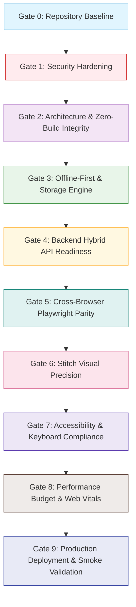

# VibeAudio Release Gates & Promotion Quality Framework
## Document ID: `QA-GATES-001`

**Status:** Authoritative Engineering Baseline  
**Version:** 1.0.0  
**Date:** September 2026  
**Lead Authors:** Release Manager, QA Architect, Principal Systems Engineer  
**Target Repository:** `c:\Users\Suraj\Documents\Antigravity\VibeAudio`  
**Cross-References:** [`QA-STRAT-001`](./VibeAudio-Testing-Strategy.md), [`SEC-BASE-001`](../security/VibeAudio-Backend-Security-Baseline.md), [`SPEC-API-001`](../implementation/VibeAudio-Backend-Hybrid-API-Spec.md)

---

## 1. Executive Summary & Gate Architecture

To ensure flawless production deployments without regressions in security, design fidelity, performance, or offline resilience, VibeAudio establishes a rigid **Ten-Stage Release Gate Framework (Gates 0 through 9)**.

No code branch or feature may merge to `main` or be promoted to production unless all predecessor gates evaluate to an unambiguous **PASS** state.



---

## 2. Release Gates 0 Through 9 Specifications

---

### Gate 0: Repository Baseline
- **Gate Identifier**: `GATE-00-REPO-BASE`
- **Purpose**: Ensure repository cleanliness, absence of unstaged artifacts, and execution of baseline unit tests.
- **Pass/Fail Criteria**:
  - `git status --porcelain` returns 0 lines (clean working tree).
  - All existing native Node.js test suites pass (12 suites, 116+ tests, 0 failures, 0 skipped).
- **Verification Command**:
  ```bash
  git diff-index --quiet HEAD -- && node --test tests/*.test.mjs
  ```
- **Required Sign-Off**: Core Engineer / CI Runner.

---

### Gate 1: Security Hardening
- **Gate Identifier**: `GATE-01-SEC-HARDEN`
- **Purpose**: Verify complete eradication of audited security vulnerabilities (SSRF, BOLA, hardcoded credentials, wildcard CORS).
- **Pass/Fail Criteria**:
  - Zero regex matches for `ADMIN_GOD`, `VIBE2026`, or `BETA_TEST` across all branches.
  - Proxy Worker rejects 100% of non-allowlisted domains with HTTP 403.
  - All authenticated Lambdas reject unauthenticated calls with HTTP 401; query param `userId` overrides are ignored.
  - All CORS headers return strict origin domain or null; zero wildcard `*` origins.
- **Verification Command**:
  ```bash
  node tests/security-baseline.test.mjs && git grep -E "(ADMIN_GOD|VIBE2026)" backend/ || exit 0
  ```
- **Required Sign-Off**: Principal Security Architect.

---

### Gate 2: Architecture & Zero-Build Integrity
- **Gate Identifier**: `GATE-02-ARCH-INTEG`
- **Purpose**: Enforce architectural invariants: zero bundler build step for frontend and deferred database engine.
- **Pass/Fail Criteria**:
  - Frontend runs via direct static file serving; no `dist/`, `build/`, Vite, Webpack, or Rollup configuration files present.
  - Abstract repository interface implemented; zero hardcoded coupling to specific production database engines.
  - Modular CSS files (`base.css`, `app-sections.css`, `components.css`, `player.css`) preserve token boundaries.
- **Verification Command**:
  ```bash
  node tools/verify-zero-build-invariants.mjs
  ```
- **Required Sign-Off**: Systems Architect.

---

### Gate 3: Offline-First & Storage Engine
- **Gate Identifier**: `GATE-03-OFFLINE-OPFS`
- **Purpose**: Verify resilient offline listening, OPFS audio sandboxing, resumable downloads, and guest-to-user migration.
- **Pass/Fail Criteria**:
  - OPFS storage engine downloads, indexes, and streams chapter audio binaries without network access.
  - Resumable download state machine successfully reconnects dropped byte streams without resetting chapter byte offset.
  - Guest listening progress merges monotonically into newly signed-in accounts without overwriting newer records.
- **Verification Command**:
  ```bash
  node --test tests/offline-shelf.test.mjs tests/download-state-machine.test.mjs tests/sync-queue.test.mjs
  ```
- **Required Sign-Off**: Offline Storage Lead.

---

### Gate 4: Backend Hybrid API Readiness
- **Gate Identifier**: `GATE-04-BACKEND-API`
- **Purpose**: Verify OpenAPI 3.1 specification compliance, latency budgets, and error rates for all 9 `/api/v1/*` endpoints.
- **Pass/Fail Criteria**:
  - All 9 endpoints return valid status codes and JSON schemas conforming to `SPEC-API-001`.
  - P95 Edge Latency for `/api/v1/catalog` < 80ms.
  - P95 Compute Latency for `/api/v1/user/progress` < 250ms.
  - Error rate under synthetic load (100 req/s for 5 mins) < 0.1%.
- **Verification Command**:
  ```bash
  node tests/api-contracts.test.mjs && npx autocannon -c 50 -d 30 http://localhost:8787/api/v1/catalog
  ```
- **Required Sign-Off**: Backend Lead.

---

### Gate 5: Cross-Browser Playwright Parity
- **Gate Identifier**: `GATE-05-PLAYWRIGHT-PARITY`
- **Purpose**: Verify end-to-end user workflows across all 5 target browser rendering engines.
- **Pass/Fail Criteria**:
  - 100% pass rate across Desktop Chromium, Desktop WebKit, Desktop Firefox, Mobile Pixel 5, and Mobile iPhone 13.
  - Zero unhandled console errors or runtime promise rejections during E2E runs.
- **Verification Command**:
  ```bash
  npx playwright test --config=playwright.config.ts
  ```
- **Required Sign-Off**: QA Automation Lead.

---

### Gate 6: Stitch Visual Precision
- **Gate Identifier**: `GATE-06-STITCH-VISUAL`
- **Purpose**: Enforce exact pixel-perfect fidelity against the approved Stitch "Light Editorial Sanctuary" screen baselines.
- **Pass/Fail Criteria**:
  - Pixel diff across all 8 registered screens (`SCR-01` through `SCR-08`) is strictly `< 0.5%`.
  - Zero layout shifts or clipped typography across Newsreader serif headings and JetBrains Mono timecodes.
- **Verification Command**:
  ```bash
  npx playwright test tests/e2e/visual-qa.spec.ts
  ```
- **Required Sign-Off**: Design Systems Lead.

---

### Gate 7: Accessibility & Keyboard Compliance
- **Gate Identifier**: `GATE-07-A11Y-WCAG`
- **Purpose**: Enforce accessibility standards and screen-reader usability.
- **Pass/Fail Criteria**:
  - Google Lighthouse Accessibility score = 100 on both Desktop and Mobile.
  - Zero critical or serious violations reported by `axe-core`.
  - Full keyboard operability for audio playback, scrubber, chapter drawer, and modals.
- **Verification Command**:
  ```bash
  node --test tests/accessibility.test.mjs && npx lighthouse-ci collect --url=http://localhost:8080/src/pages/app.html
  ```
- **Required Sign-Off**: Accessibility Specialist.

---

### Gate 8: Performance Budget & Core Web Vitals
- **Gate Identifier**: `GATE-08-PERF-VITALS`
- **Purpose**: Enforce instant page load and zero runtime bloat.
- **Pass/Fail Criteria**:
  - Largest Contentful Paint (LCP) < 1.2s on simulated 4G mobile.
  - Cumulative Layout Shift (CLS) = 0.00.
  - First Input Delay / Interaction to Next Paint (INP) < 50ms.
  - Total frontend bundle size overhead = 0 KB (zero extra build dependencies).
- **Verification Command**:
  ```bash
  npx lhci assert --assertions.largest-contentful-paint=1200 --assertions.cumulative-layout-shift=0
  ```
- **Required Sign-Off**: Performance Engineer.

---

### Gate 9: Production Deployment & Smoke Validation
- **Gate Identifier**: `GATE-09-PROD-SMOKE`
- **Purpose**: Validate staging canary deployment, health check responses, and automated rollback readiness.
- **Pass/Fail Criteria**:
  - Staging smoke test suite passes 100% against live staging Edge Worker and Lambda compute.
  - Rollback dry run executes successfully in < 30 seconds.
- **Verification Command**:
  ```bash
  node tools/production-smoke-test.mjs --env=staging
  ```
- **Required Sign-Off**: Release Manager & Operations Lead.

---

## 3. Gate Promotion & Sign-Off Matrix

| Gate ID | Stage | Automatic / Manual | Blocking Level | Primary Responsible Role |
| :--- | :--- | :--- | :--- | :--- |
| `GATE-00` | Pre-Commit / PR | Automated | Hard Blocker | Authoring Engineer |
| `GATE-01` | PR CI Check | Automated | Hard Blocker | Security Lead |
| `GATE-02` | PR CI Check | Automated | Hard Blocker | Systems Architect |
| `GATE-03` | PR CI Check | Automated | Hard Blocker | Offline Storage Lead |
| `GATE-04` | Integration Pipeline | Automated | Hard Blocker | Backend Lead |
| `GATE-05` | Staging Pipeline | Automated | Hard Blocker | QA Automation Lead |
| `GATE-06` | Staging Pipeline | Automated | Hard Blocker | Design Systems Lead |
| `GATE-07` | Staging Pipeline | Automated | Hard Blocker | Accessibility Specialist |
| `GATE-08` | Staging Pipeline | Automated | Hard Blocker | Performance Engineer |
| `GATE-09` | Production Canary | Automated + Manual | Release Blocker | Release Manager |
