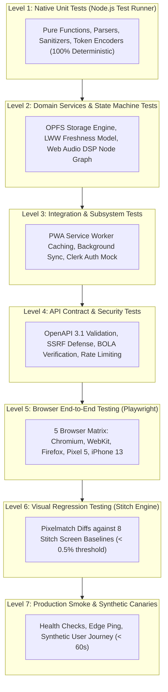

# VibeAudio Comprehensive Testing Strategy & Quality Assurance Architecture
## Document ID: `QA-STRAT-001`

**Status:** Authoritative Engineering Baseline  
**Version:** 1.0.0  
**Date:** September 2026  
**Lead Authors:** Principal QA Architect, Test Automation Lead, Performance Engineer  
**Target Repository:** `c:\Users\Suraj\Documents\Antigravity\VibeAudio`  
**Cross-References:** [`QA-E2E-001`](./VibeAudio-Playwright-Test-Spec.md), [`QA-GATES-001`](./VibeAudio-Release-Gates.md), [`SPEC-API-001`](../implementation/VibeAudio-Backend-Hybrid-API-Spec.md)

---

## 1. Executive Summary & Quality Vision

VibeAudio is a mission-critical personal listening sanctuary. Its testing architecture is engineered around the principle of **Defensive Automation**: comprehensive automated coverage from pure native unit tests to real-browser cross-platform Playwright suites and visual regression benchmarks.

### Key Quality Principles
1. **Zero External Test Framework Overhead for Unit Tests**: Unit and domain service tests execute exclusively via Node.js native test runner (`node --test`) with zero runtime dependencies (no Jest, Mocha, or Vitest bloat).
2. **Real-Browser Truth**: UI, offline OPFS caching, Media Session handling, and background sync are tested in authentic headless browser runtimes using Playwright.
3. **Continuous Invariant Enforcement**: Critical invariants (zero build step, deferred database selection, monotonic LWW progress, WCAG 2.1 AA accessibility) are validated as strict CI release blockers.

---

## 2. The VibeAudio Testing Pyramid



---

## 3. Subsystem Test Matrices & Invariant Assertions

### 3.1 Subsystem 1: Audio Player Engine
- **Target Files**: `frontend/src/js/player.js`, `frontend/src/js/ui-player-helpers.js`
- **Required Invariants & Assertions**:
  1. *Lifecycle Token Monotonicity*: Rapidly switching chapters invalidates pending audio loading promises; no race condition allows a superseded chapter to play over a newer track.
  2. *Format Support*: Audio element successfully loads MP3, AAC, and M4B streams.
  3. *Media Session Sanitization*: Artwork dimensions are positive integers; position state updates are clamped between `0` and `duration`; hardware headphone buttons (Play/Pause/Seek) dispatch correct events.
  4. *Sleep Timer Curve*: Volume smoothly interpolates to zero over exactly 5.0 seconds before calling `.pause()`.
  5. *Web Audio Filter Graph*: Vocal clarity filters (`bassCutFilter`, `vocalPeakingFilter`, `trebleBoostFilter`, `compressor`) connect without audio clipping or phase distortion.

### 3.2 Subsystem 2: Offline Storage & OPFS Engine
- **Target Files**: `frontend/src/js/offline-shelf.js`
- **Required Invariants & Assertions**:
  1. *OPFS Detection & Fallback*: If `navigator.storage.getDirectory()` is available, binaries stream directly to OPFS sandbox. If unavailable or quota exceeded, falls back seamlessly to IndexedDB Blob storage.
  2. *Resumable Downloads*: If network connection drops mid-download, the byte range state machine records downloaded offset and resumes without restarting the chapter.
  3. *Integrity Verification*: Downloaded chapter blobs match expected `Content-Length` and SHA-256 hash before being marked `STATUS_READY`.
  4. *Eviction & Quota Safety*: Never consumes more than 80% of available browser quota; warns user when available storage falls below 500MB.

### 3.3 Subsystem 3: Progress Synchronization & LWW Freshness
- **Target Files**: `frontend/src/js/progress-model.js`, `frontend/src/js/user-data.js`, `backend/lambda/saveProgress.js`
- **Required Invariants & Assertions**:
  1. *Monotonic Freshness*: Given two progress entries for the same book, `compareProgressFreshness()` always selects the entry with the strictly newer ISO 8601 timestamp.
  2. *Automatic Chapter Completion*: When `currentTime >= totalDuration * 0.98`, `currentChapterFinished` is set to `true`.
  3. *Offline Queue Resilience*: Offline progress checkpoints append to IndexedDB `vibeaudio-sync-v1` without loss and flush in chronological order upon reconnection.
  4. *Guest Migration Safety*: Guest records never overwrite newer authenticated cloud progress.

### 3.4 Subsystem 4: Authentication & Session Security
- **Target Files**: `frontend/src/js/auth.js`, `backend/lambda/auth.js`
- **Required Invariants & Assertions**:
  1. *Zero Hardcoded Bypass*: Submission of any legacy bypass code (`ADMIN_GOD`, `VIBE2026`) is rejected with 401 Unauthorized.
  2. *Clerk JWKS Verification*: JWT signature, expiration, and audience are cryptographically validated against Clerk JWKS.
  3. *BOLA Prevention*: Handlers extract `userId` strictly from verified JWT `sub` claim; query parameters or body attributes labeled `userId` are ignored.

### 3.5 Subsystem 5: Backend APIs & Edge Gateway
- **Target Files**: `backend/workers/proxymanager.js`, `/api/v1/*`
- **Required Invariants & Assertions**:
  1. *SSRF Defense*: 100% of requests to private IPs (`127.0.0.1`, `169.254.169.254`, `10.0.0.0/8`) and non-allowlisted domains receive HTTP 403 Forbidden.
  2. *Strict CORS*: Origin reflection matches only authorized production and staging domains (`*.vibeaudio.pages.dev`). Wildcard `*` is prohibited.
  3. *Error Sanitization*: 500 responses return clean error envelopes without call stacks or database driver details.
  4. *HTTP 206 Seeking*: Proxy worker responds with valid `Content-Range` and `Accept-Ranges: bytes`.

### 3.6 Subsystem 6: Responsive UI & Stitch Sanctuary Design System
- **Target Files**: `frontend/src/css/*.css`, `frontend/src/pages/app.html`
- **Required Invariants & Assertions**:
  1. *Viewport Adaptation*: Desktop (1920x1080), Tablet (768x1024), and Mobile (390x844) render without horizontal overflow (`document.documentElement.scrollWidth === window.innerWidth`).
  2. *Mini-Player Floating Dock*: Fixed height `62px`, floating `16px` above bottom navigation, micro-scrubber visible.
  3. *Theme Contrast*: Canvas `#F5F5F7` against text `#1D1D1F` maintains contrast ratio $\ge 7:1$ (exceeding WCAG AAA).

### 3.7 Subsystem 7: Accessibility (WCAG 2.1 AA)
- **Target Files**: All HTML templates and component modules
- **Required Invariants & Assertions**:
  1. *Zero Axe-Core Violations*: Automated axe-core scan passes with zero critical or serious defects.
  2. *Full Keyboard Traversal*: All interactive elements (play, pause, scrub, chapters, modal dialogs) are operable via `Tab`, `Space`, `Enter`, and arrow keys.
  3. *Screen Reader Announcements*: Live regions (`aria-live="polite"`) announce chapter changes, playback states, and sync status updates.

### 3.8 Subsystem 8: Service Worker & PWA Hardening
- **Target Files**: `frontend/service-worker.js`, `frontend/app.webmanifest`
- **Required Invariants & Assertions**:
  1. *Precache Completeness*: All 40 static assets precache successfully on install event.
  2. *Offline Navigation*: Refreshing the app while offline successfully loads the cached application shell.
  3. *Sensitive Bypass*: Requests to Clerk and `/api/v1/auth/*` bypass service worker cache completely.

---

## 4. Test Execution Commands & CI/CD Pipeline

```bash
# Level 1 & 2: Native Unit & Domain Tests (Fast, < 2 seconds)
node --test tests/*.test.mjs

# Level 3 & 4: API Contract & Security Mock Tests
node --test tests/api-contracts.test.mjs tests/security-baseline.test.mjs

# Level 5: Playwright Cross-Browser End-to-End Suites
npx playwright test --config=playwright.config.ts

# Level 6: Stitch Visual Regression Test Suite
npx playwright test tests/e2e/visual-qa.spec.ts

# Complete Release Gate Verification Suite
npm run verify:all
```

---

## 5. Test Environment Matrix & Mock Boundaries

| Subsystem | Testing Strategy | Environment / Dependencies | Mocking Boundary |
| :--- | :--- | :--- | :--- |
| **Unit / Math / Logic** | Pure Deterministic | Node.js native test runner | None required |
| **OPFS / Storage** | Real Browser Sandbox | Playwright Chromium/WebKit | Native browser filesystem |
| **Clerk Auth** | Mocked Token Provider | Node.js / Playwright Mock | Fake JWKS endpoint & RSA key pair |
| **Audio Streaming** | Mocked Byte Chunks | Cloudflare Worker Local Runner | Synthetic 1MB MP3 buffer |
| **Cloud Persistence** | Abstract Repository | In-Memory / SQLite Local | Database selection deferred |
